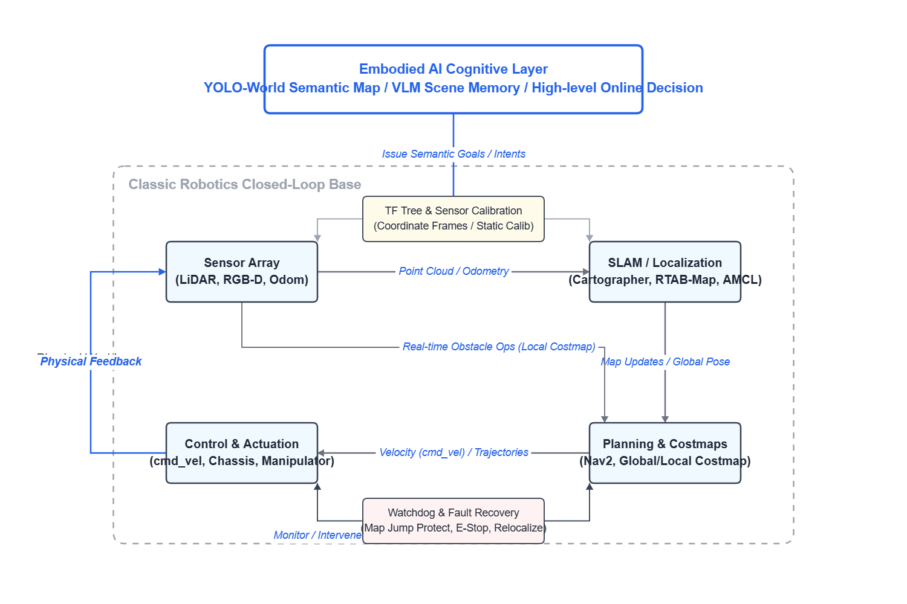
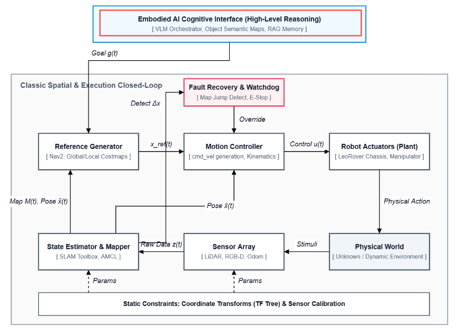
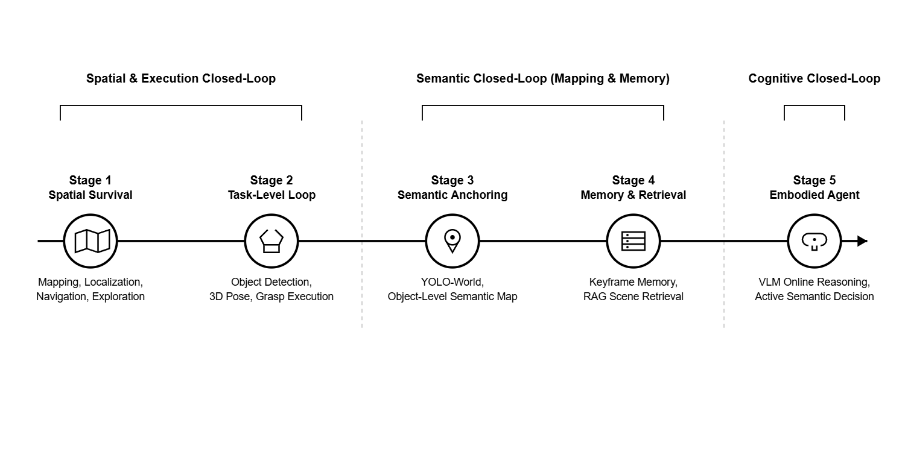
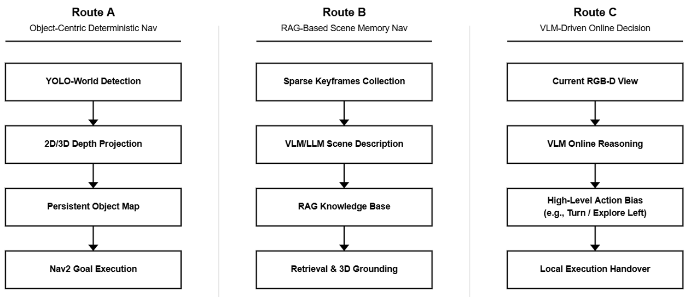

# 00 From Classical Robotics to Embodied Agents

## What This Series Is Trying to Answer

This is not a series of "I hooked up another big-model API" posts, and it is not a paper-style note about "I implemented some new algorithm" either.

The real question it wants to answer is much simpler, and honestly a bit more down to earth:

If one person does not have a big company's data, compute, or team, and only has the conditions of an individual developer or a small lab, is it still possible to build a robot system step by step, starting from basic mapping and navigation, and push it toward an embodied agent with semantic understanding, scene memory, and real-time decision-making?

The starting point of this project was never to invent a new world model, redefine robotics, or prove the SOTA of some single model. What I actually wanted to test was something else, something people often ignore but that matters much more in real robots:

**Real robot capability is not decided by one "strongest model." It comes from the closed loop between perception, localization, planning, control, memory, interaction, and engineering robustness.**

So this series is not an algorithm myth, and it is not me trying to show how impressive I am. It is just an as-honest-as-possible record of how a full system grows and evolves. It is also a way for me to document what I got done over the past few months.

## Why I Want to Start with Classical Robotics

Over the past few years, "embodied intelligence" has become a very hot term. A lot of discussions jump straight into VLMs, Agents, World Models, RAG, and end-to-end policies, as if plugging a bigger model into a robot would naturally give it the ability to understand the world and act in it.

But once you actually run a robot, you quickly realize reality does not work like that at all.

If a robot wants to do anything in the physical world, it first has to solve a bunch of very unsexy but completely unavoidable problems:

- Where is it
- Where around it is traversable, and where is not
- How the things it sees right now get grounded into a stable coordinate frame
- Whether its control commands can actually be executed reliably by the base and actuators
- Whether the whole system falls apart when sensors jitter, parts of the scene get occluded, the map jumps, or localization gets lost

All of these are, at their core, classical robotics problems. `SLAM`, `Nav2`, `TF`, `MoveIt2`, sensor calibration, action services, fault recovery... these things may not sound very "cutting edge," but they are exactly the foundation that all later semantic ability depends on.

So I do not want to write this series as some slogan like "classical methods are outdated, now large models take over everything." A more accurate way to put it would be:

**Embodied intelligence is not a replacement for classical robotics. It is a new cognitive layer built on top of classical closed-loop systems.**

Without a stable spatial loop, semantics have nowhere to land. Without a reliable execution loop, understanding cannot turn into action. Without engineering robustness, so-called "intelligence" is just an occasional success under demo conditions.

## This Is Not a Feature List, but More Like an Evolution of Capability

This series will not be written as "here are the packages inside this repo," and it will not just stack screenshots under "here are the features I built."

What I care more about is this: how does a robot system grow its abilities layer by layer?

In my view, the rough path looks like this:

1. First, gain the most basic ability to survive in space  
   That means mapping, localization, navigation, and exploration. A robot should at least be able to close the loop in an unknown environment before we start talking about intelligence.

2. Then gain task-level closed-loop ability  
   That means connecting mobility, perception, target recognition, pose transformation, and grasping into one chain, so the system is not just "able to move," but "able to finish a task pipeline."

3. Then gain semantic grounding  
   That means the robot no longer only knows "there is an obstacle here," but also "there is a green trash bin here" or "there is a table over there," so semantics finally land on real spatial coordinates.

4. Then gain memory and retrieval  
   That means the robot no longer relies only on real-time detection, but can store scenes it has seen and later retrieve them again through language and semantic search.

5. Only after that do we get to more aggressive online semantic decision-making  
   That means not building a full object map in advance, and not relying entirely on offline memory either, but letting a vision-language model directly take part in the high-level question of "where to go next, and why."

These five steps are definitely not some strict industrial standard, and they do not mean the later routes are automatically "more advanced" than the earlier ones. They are closer to three different layers of capability being stacked together:

- Spatial closed loop
- Semantic closed loop
- Cognitive closed loop

What this project really wants to show is not how many trendy terms I managed to pack into one repo, but whether I can connect these closed loops together one by one.

## Why Volume Two and Volume Three Focus on Three Semantic Navigation Paradigms

If this series only had "mapping and navigation" plus a "grasping demo," then at the end of the day it would still just be a pretty complete ROS2 integration project.

What made me feel this work started to become worth discussing was that, inside one single system, I gradually implemented three completely different semantic navigation routes.

### Route A: Deterministic Semantic Navigation Based on an Object Map

This route relies on open-vocabulary detectors like `YOLO-World`. The core logic is:

- The robot moves while observing
- It detects concrete objects in real time
- It combines depth and TF to project 2D detections into the 3D / map frame
- It gradually builds an "object distribution map"
- When the user says "go next to the green trash bin," the system directly pulls out the target coordinate from the object map and calls `Nav2`

The strength of this route is that it is very deterministic and very interpretable. At least, at least, you can clearly say: "The target is at this coordinate, and the robot is going to that coordinate."

Its weakness is also obvious: it depends on the object being detected correctly, projected correctly, and stored correctly. It is more like an **object-level world model**, and it is best at handling targets that are clear, concrete, and easy to name.

### Route B: Retrieval-Based Semantic Navigation from Scene Memory

This route stops trying to force every object into one stable coordinate and switches to another way of thinking:

- The robot records keyframes while exploring
- Each keyframe is tied to RGB, depth, and pose
- A multimodal model analyzes scene content offline and builds a searchable memory bank
- During navigation, instead of asking "which object is at which coordinate," it asks "have I seen this scene, this area, or this kind of description before?"

The strength of this route is that it is friendlier to fuzzy semantics. For example, "go near that messy table from earlier" or "go to the place that looks like a dining area" may not fit neatly into a strict object ID, but they may work very well with memory retrieval.

The problem is that it is less deterministic, the explanation chain is longer, and it is much more sensitive to memory quality, description quality, and retrieval quality. And of course, the endpoint given by a large model may not be the same every time. This time it might send you east, next time northeast.

### Route C: Online High-Level Decision Making with a VLM

The third route is more aggressive. It does not maintain a full object graph in advance, and it does not fully rely on offline memory retrieval either. Instead, it lets a vision-language model directly take part in high-level control for the current task:

- Look at the current scene
- Understand the current semantic context
- Decide which side to explore next, what target to approach, and when to hand control back to more fine-grained local perception and execution modules

What makes this route powerful is flexibility. It can handle more than just "which point on the map." It can also deal with higher-level judgments like "which direction currently looks more like the target area" or "which candidate direction makes more sense."

But this route is also the easiest one to misunderstand. It does not mean classical maps, odometry, obstacle avoidance, and action loops suddenly disappear. More accurately, it only hands **high-level semantic decision-making** to the model. It does not swallow the entire robot control problem end to end.

So volume two is not just showing three functions. It is really comparing three cognitive styles:

- The deterministic object-coordinate camp
- The memory-driven scene-retrieval camp
- The online-reasoning high-level-decision camp

## Where the Real Value of This Project Is

I do not think the most valuable part of this project is that one node has pretty code, or that some model integration looks fashionable.

At this point, I would summarize its real value in four parts.

### 1. It Tries to Pull the "AI Narrative" Back Into Robot Reality

A lot of AI demos like to stop at "what the model understood," but what robots eventually have to deal with is:

- Coordinate frames
- Latency
- Control frequency
- Occlusion
- False detections
- Drift
- Recovery

In this project, every kind of "intelligence" has to land inside a real execution chain. It cannot just stay as text output on a screen.

### 2. It Tries to Build a Reproducible Evolution Path Under Individual Constraints

This is not an enterprise platform, and it is not a large fleet of real robots. Precisely because the resources are limited, I care more about this question: within the range one person can actually control, how far can a system be pushed?

I am just a regular MSc student. To be honest, I may only have one year to use school resources to build this project, and after that I still need to think about making a living.

If this project has value, that value is not that it is "globally unique." The value is that it shows **a relatively complete embodied-system integration path that one person can actually walk through**.

If I really tried to compare myself with major companies, expensive hardware stacks, or top university teams, I would look ridiculous.

### 3. It Keeps the Failures, Patches, and Compromises

Real robot projects are not a clean curve from paper to victory. They are full of patches, detours, monitoring nodes, protection mechanisms, manual confirmation, and compromise-heavy architectures.

So in the later posts, I will not only write "it worked." I will also write:

- Why I needed a watchdog
- Why I needed protection against map jumps
- Why some actions have to stay human-in-the-loop
- Why some routes look great in simulation but expose their problems on a real robot

These things are not romantic, but they are closer to real systems than any sentence about "end-to-end intelligence."

### 4. It Is More Like a Roadmap Than an Endpoint

I do not see this project as a finished product. It feels more like a path that has already been walked out:

- From classical navigation to task execution
- From object semantics to scene memory
- From offline knowledge to online decision-making
- From simulation demos to real-world confrontation

It may not be the final answer, but at least it exposes the shape of the problem.

## How to Read This Series

To keep the whole thing from turning into a loose pile of features, I split it into several volumes.

### Volume One: Physical Foundations and Classical Closed Loops

This volume is about the ground everything else stands on:

- `SLAM`
- `Nav2`
- Autonomous exploration
- A full closed loop for mobile manipulation

Without this volume, all the later "semantic" and "embodied" parts have no reliable place to stand.

### Volume Two: The Perception Shift, Two Very Different Semantic Navigation Routes

This is the core volume of the whole series.

I will write about:

- Object-level online labeling and navigation based on `YOLO-World`
- Scene-memory retrieval navigation based on `LLM/VLM + RAG`

These two posts will answer one shared question:

When a robot starts to "understand semantics," is it really understanding objects, or is it understanding scenes?

### Volume Three: Moving Toward Embodied Agents

This volume focuses on more aggressive experiments:

- No longer building a full semantic map first
- No longer relying entirely on offline memory
- Letting a `VLM` directly join the high-level exploration and decision-making of the current moment

I will not mythologize the model here. On the contrary, I want to be honest about where it is strong, and where it still cannot work without classical robotics underneath.

### Volume Four: Crossing Into the Real World and Dealing with Physical Friction

This volume talks about the part many projects avoid most easily, but the part that shows engineering ability most clearly:

- Simulation-to-real interface coupling
- Splitting the launch architecture
- Watchdog
- Protection against map jumps
- Recovery from lockups
- Failures and patches

If the earlier volumes are about how capability grows, this volume is about how that capability survives in the real world.

### Volume Five: Side Stories and Side Experiments

This volume includes things that are not directly part of the main line, but still worth recording:

- Gesture control for the robot arm
- ROSplat / 3D Gaussian Splatting visualization

They may not be part of the main capability chain, but they help me understand more completely how a robot is operated by people, observed by people, and interpreted by people.

Of course, all of this exploration is based on the hardware I already have, and it all runs in simulation. If I had better hardware and more experimental support, I would probably explore more.

### Final Chapter: Comparing the Three Semantic Navigation Paradigms

At the end, I will do one full comparison and come back to a basic question:

If the goal is to build a truly useful embodied robot system under the conditions of one person or a small-scale lab, then:

- Object maps
- Scene memory
- Online VLM decision-making

What is each one actually good at, and where does each one get stuck?

I do not want this series to become a "more and more advanced" success-story narrative. I want it to be a comparison with some judgment in it: which routes are worth digging into further, and which ones, at least for now, are still better suited for research demos than real engineering deployment.

## Written at the Beginning, and Also at the End

If this is your first time seeing this project, I hope you do not read it as "a repo that plugged in every trendy keyword once."

A more accurate way to read it would be:

**This is a system-integration experiment that tries to connect classical robotics, semantic perception, scene memory, and embodied agents into one continuous path of evolution under individual constraints.**

It is not perfect, and it is not mysterious. It contains plenty of patches, plenty of compromises, and plenty of problems that are still unsolved.

But that is exactly why it is worth writing down.

Because the thing that really has value is often not the part that looks the most like "the future." It is how you slowly press that future back into a system that can actually run today.

One last thing I want to say is that most of this project runs in simulation. All of the maps are simplified abstract simulation maps, and because time was limited, they are very simple ones too. That will also show up in the later demos. So yes, there is definitely a risk that what the robot can do in this environment is a bit overfit.

But I have been trying not to tune things too specifically to any single existing map. I want the system to keep some generalization ability, and I want to map my actual questions and thinking back into the project. For example: if I swap in a more complex map, can it still finish the whole pipeline?

Also, I try to get each module to what I would call a satisfying 80 out of 100, not 100 out of 100. The world is not perfect, simulation is not perfect, reality is not perfect either. What I can do is try to make each part reach a solid 80 in one setting. For example, maybe the robot's path planning is still inefficient, but if it has gone from "it cannot even move at all" to "it can complete the task," that is already a major breakthrough. I do not need it to be elegant from day one. I need it to be passable first, so there is something real to keep improving.

And yes, to make the demo look better, I will probably edit the videos into what I think counts as an "80-point version." Maybe by whatever means necessary.

One more practical note: this project is fully built around `leorover`, `mycobot280`, `D435`, and `rplidar`. It has been optimized specifically around that hardware stack. If you want to use other mobile bases or robot arms, you will need further hardware-specific changes and tuning.

Right now, I am tentatively planning to open-source the project sometime after September 2026. But even before that, I hope these posts can at least give readers some ideas and a few ways to avoid obvious pitfalls. Before the full release, I may start with a Dockerized demo package first.

