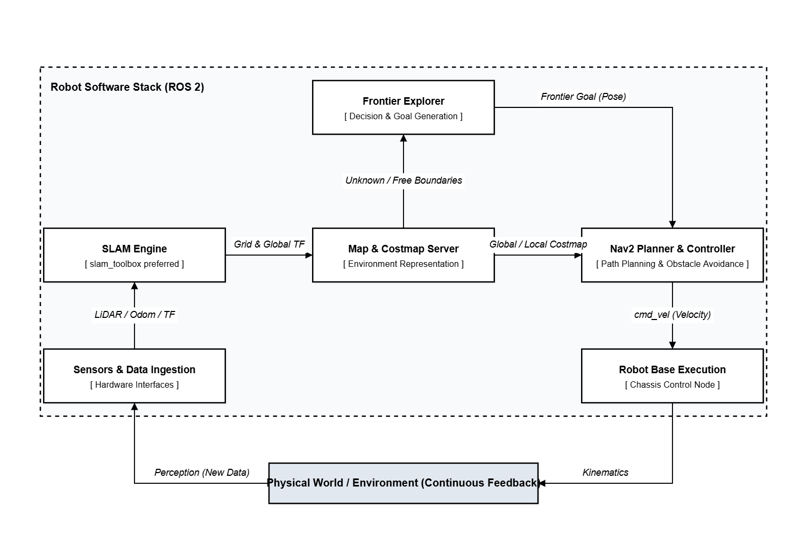
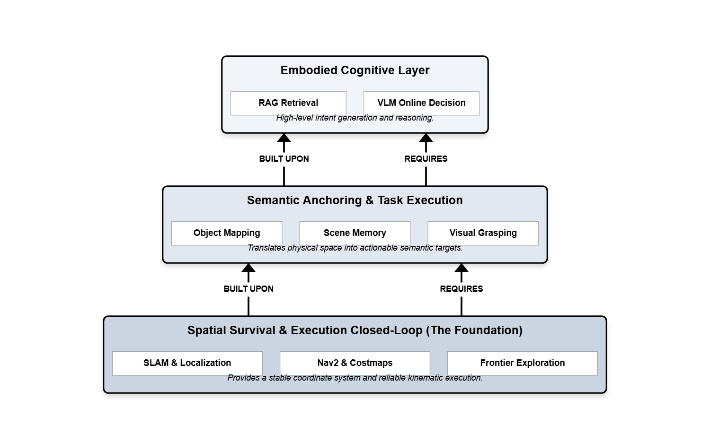

# 01 经典路径：从零跑通 SLAM 建图与自主探索

## 为什么第一篇必须先写这个

如果一个机器人连“自己在哪、周围哪里能走、怎么把未知区域一点点探出来”都做不到，那后面那些更花哨的语义导航、场景记忆、VLM 决策，其实都没有真正的落点。

所以这套系列的第一篇，我不想先写大模型，也不想先写抓取。我必须先从最老实、也最容易把人劝退的部分写起：

- 建图
- 定位
- 导航
- 探索

说得更直白一点，这一篇处理的是机器人最基础的空间生存问题。

它不亮眼，也不新。但它是后面所有能力的地板。

## 很多人低估了“先跑通导航”这件事

很多不真正碰机器人系统的人，会天然觉得 SLAM 和 Nav2 是最“传统”、最“已经成熟”的那一部分，似乎把现成包一接，机器人就应该自己跑起来。

这件事在 PPT 上看确实很像这样。

但只要你真的开始联调，就会很快发现，所谓“导航已经是成熟技术了”，和“你的机器人现在就能稳定导航”，中间隔着非常远的一段学习距离，工程距离更是一大截（我不会碰瓷工程概念那么多的...）。

因为这里真正难的，从来都不是单独某一个包，而是整个闭环能不能同时成立：

- 激光数据和里程计是不是稳定
- `TF` 树是不是干净
- 建图节点和导航节点之间会不会互相打架
- `costmap` 的参数是不是会让机器人在角落里来回抖
- 局部规划器是不是会在窄区域里陷入犹豫
- exploration 节点给出来的 frontier goal 到底是不是“看起来能去，实际上去不了”

只要这里面有一环不稳，最后表现出来的就不是“局部有点瑕疵”，而是整台机器人很像有点精神分裂。

最常见的表现我基本都见过：

- 原地转圈
- 明明前面能走却反复后退
- 地图边缘来回试探，像卡住一样
- 局部路径一会儿有一会儿没
- frontier 点看起来很合理，过去就是失败

所以这里我要提一嘴，如果连仿真都跑不通，你凭什么直接上真机跑？？？身边其实挺多同学仿真都不跑直接上真机测，我其实觉得就是浪费时间....本来一周的实验时间就不多。

所以我后来慢慢接受了一件事：**导航不是一个算法问题，而是一个系统闭环问题。**

## 这一篇真正做了什么

这一部分的目标，不是“演示机器人能点到点移动”，而是从零搭出一条完整的基础空间能力链（相当于把底盘搭好了，有这一整套至少能动的底盘，后面升级迭代会方便很多）：

1. 在仿真环境中生成机器人与传感器
2. 跑通 `SLAM`，让机器人在未知环境里实时建图
3. 跑通 `Nav2`，让机器人具备路径规划与局部避障能力
4. 引入 frontier-based exploration，让系统自动给自己生成下一步探索目标
5. 让整套系统在连续运行中尽量稳定，而不是只截一小段成功视频

这件事听上去很标准，但真正重要的是，你不能把它理解成五个独立模块。  
它们必须同时在线、同时对齐、同时交换状态，而且最好不要彼此添乱。

`SLAM` 负责的是“世界正在被怎样解释”。  
`Nav2` 负责的是“在当前解释下怎么移动”。  
`Exploration` 负责的是“下一步应该去哪里扩展已知空间”。  

这三者叠起来，才构成了一个最低限度可以自己长出地图的机器人。

还有一个当时很真实的选型问题，是 `SLAM` 后端到底用谁。

我这个项目里其实一直把 `slam_toolbox` 和 `cartographer` 两条 launch 都保留着，不是为了显得配置很多，而是因为我当时确实认真试过两边，当然删了也怪可惜的。

一开始我对 `cartographer` 期待很高。它建出来的图确实很清晰，边界也漂亮，尤其是手动慢慢建图的时候，观感是很好的，而且我当时也明显感觉到它有时候比另一边更不容易出现那种很明显的地图跳变。

但问题是，**手动建图表现好，不等于它适合我这条探索闭环。**

真把它放进“边建图、边导航、边探索”这条链里以后，整个系统会出现一种很强的拉扯感（本质上是 Cartographer 的后台图优化（Graph Optimization）与 Nav2 控制器之间的“TF 争夺战”）。以我当时的理解，比较像是 `IMU`、里程计和 map 约束没有在这套组合里很好地站到同一边，频繁引发了 map -> odom 的 TF 跳变。于是机器人一边想往前走，一边又被位姿修正往回拽。最后表现出来就是：

- 探索时底盘动作会比较抽
- 来回拉扯感很强
- 某些时候局部运动显得很激进
- 人看着会觉得机器人不是在“推进”，而是在“挣扎”

所以最后我没有把它作为这条 exploration workflow 的主后端。不是因为 `cartographer` 不行，更不是说它不适合探索，而是至少在我这个平台、这套传感器条件、这组参数和时间成本下，要把它调到真正适合这条闭环，代价是很高的。

最后我还是更多落回 `slam_toolbox` 这一边。原因也不复杂：我在这里更看重的不是“哪张图静态看上去更漂亮”，而是探索的时候整条链能不能更稳地往前推。对这个项目来说，稳定推进比单帧地图观感更重要。还是那句老话，我只要实现和结果。

## 我真正踩坑的，不是建图本身，而是“边建图边导航边探索”

如果只是单独把 SLAM 跑起来，其实没那么难。  
如果只是给一张已经存在的地图做导航，也没那么难。

真正难的是这三件事一起发生：

- 地图还在变
- 机器人还在动
- exploration 还在不断往系统里塞新的目标

这时候很多在单模块里看不见的问题，会一起冒出来。

比如地图还没稳定，frontier 点就已经生成了（点点瞎跳）。  
比如局部规划器刚想绕开障碍，地图又更新了，路径就变了（车车抖动）。  
比如某一刻 global costmap 看起来能走，但 local costmap 因为膨胀层或者传感器噪声，实际上不敢过去。  
这些问题很难用一句“参数没调好”带过，它们更像是多个模块在时间维度上没有真正达成一致。

（这里我自己写了一个类似explore-lite的探索节点-pink_exploration。这里又体现了老问题，开源的东西有时候你还真不可以直接拿来用，甚至只能看个思路自己去改。explore-lite
在 LeoRover 这种滑移转向四轮平台上，和当时的 SLAM + Nav2 闭环耦合得不稳定。典型问题是 frontier 目标经常看起来可达、实际导航失败，机器人在地图边缘反复试探、原地转动多、进展慢。）

所以这篇文章真正想写的，不是“我用了什么包”，而是：  
**一个移动机器人如何在一个还没有被它认识清楚的世界里，持续生成行动、持续修正认识、又尽量不把自己逼进死角。**

这句话听起来有点绕，但机器人导航本来就不是一条干净的直线。

## 经典机器人最强的地方，不是聪明，而是闭环

我后来越来越觉得，经典机器人系统最值得尊敬的地方，不是它“理解”得有多深，而是它特别强调闭环。

它并不装作自己懂世界的一切。它只是很老实地处理下面这些事：

- 先把未知和已知分开
- 再把可走和不可走分开
- 然后在当前认知下做一个尽量合理的动作
- 动完以后重新感知，再修正判断

这种方法不浪漫，但非常硬。

它的哲学其实很像一种工程版的生存逻辑：  
我不需要先知道整个世界是什么，我只需要先在当前时刻不撞墙，并且持续让我的世界模型变得更完整一点。

从这个角度看，SLAM + Nav2 + Exploration 不是“老掉牙的基础模块”，而是机器人进入真实空间之前最重要的成年礼。

## 为什么这一层对后面所有文章都重要

后面你会看到物体语义地图、关键帧记忆、RAG 检索、VLM 在线决策，看起来都比这一篇更“聪明”。

但它们有一个共同前提：它们都默认机器人已经有一个基本稳定的空间坐标系和行动能力。

不然会发生什么？

- 你检测到了一个垃圾桶，但不知道它稳定地在地图哪里
- 你记住了一张场景图，但关键帧姿态本身就是飘的
- 你让 VLM 判断往左还是往右，但底盘连基础避障都不稳

这时候所谓的高层语义，只会变成漂浮在系统上方的一层描述，而不是可执行能力。

所以第一卷必须先把这件事讲透：  
**机器人不是先有“理解”，再有“行动”；在工程上，它往往是先获得稳定行动能力，理解才开始真正变得有意义。**

啰嗦一下，这全部的文章都不会写成类似教程啥的，也不会按 launch 文件从上到下逐行解释。

我更想按一个系统真正长起来的顺序来写它：

1. 先把仿真和机器人底座搭起来
2. 再让地图开始长出来
3. 再让导航真正接管运动
4. 再把 exploration 接进来，让机器人自己给自己派任务
5. 最后再讨论那些最烦但也最关键的问题：抖动、卡死、转圈、局部失败、恢复机制

也就是说，我真正关心的不是“怎么把 demo 点亮”，而是“怎么把一个基础闭环变成能持续工作的系统”。

## 写在第一篇的最后

如果把整个项目比作一座建筑，这一篇写的就是地基。  
它不好看，也不适合拿来当封面，但你后面看到的每一层，最后都压在它上面。

很多时候我觉得机器人工程最反直觉的地方就在这里：  
最让人上头的部分，往往不是最先该做的部分。  
最值得炫耀的能力，也往往不是最先必须成立的能力。

你得先让机器人别迷路，别撞墙，别在未知空间里发疯。  
后面那些更像“智能”的东西，才有资格慢慢长出来。

所以就要从这一篇开始。

