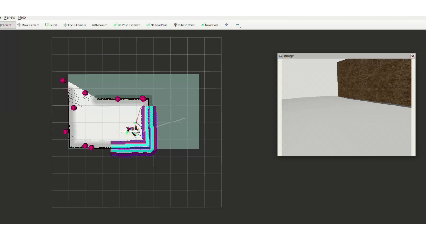

# 01 The Classical Path: Getting SLAM Mapping and Autonomous Exploration Working from Scratch

## Why the First Article Had to Start Here

If a robot cannot even figure out where it is, where it can move, and how to gradually uncover an unknown space, then all the fancier things that come later, semantic navigation, scene memory, VLM decision-making, do not really have a place to stand.

So for the first post in this series, I did not want to start with large models, and I did not want to start with grasping either. I had to begin with the most basic part, and also the part that most easily makes people lose interest:

- Mapping
- Localization
- Navigation
- Exploration

To put it more directly, this article is about the robot's most basic problem of spatial survival.

It is not flashy, and it is not new. But it is the floor under everything that comes later.

## A Lot of People Underestimate What It Means to "Get Navigation Working First"

People who do not really work with robot systems often assume SLAM and Nav2 are the most "traditional" and the most "mature" parts, so once you hook up the existing packages, the robot should basically run on its own.

On a PPT slide, it really does look like that.

But once you actually start integrating and debugging the whole stack, you quickly realize that "navigation is mature technology" and "your robot can now navigate stably" are very, very far apart. The learning gap is big, and the engineering gap is even bigger.

Because the hard part here is never one single package. The real question is whether the whole loop can hold together at the same time:

- Are the lidar data and odometry stable
- Is the `TF` tree clean
- Are the mapping node and the navigation node fighting each other
- Do the `costmap` parameters make the robot shake in corners
- Does the local planner get indecisive in narrow areas
- Are the frontier goals given by the exploration node actually reachable, or do they only look reachable

If even one link in that chain is unstable, what you get in the end is not "a small flaw here and there." The whole robot starts to look slightly mentally unstable.

I have seen pretty much all the classic symptoms:

- Spinning in place
- Backing up again and again when the front is clearly open
- Poking around near the map edge like it is stuck
- Local paths appearing and disappearing
- Frontier points that look reasonable but always fail in practice

So I want to say this plainly: if you cannot even get it running in simulation, why are you jumping straight onto the real robot? I have seen a lot of people around me skip simulation and go directly to hardware, and honestly I think that is just wasting time. A week of lab time is already short enough.

So later on, I slowly accepted one thing: **navigation is not just an algorithm problem. It is a full closed-loop system problem.**

## What This Article Actually Built

The goal here was not just to show "the robot can move from point A to point B." The goal was to build a complete basic spatial capability chain from scratch. You can think of it as building the chassis properly first. Once that base exists and can actually move, later upgrades become much easier.

1. Spawn the robot and sensors in simulation
2. Run `SLAM` so the robot can build a map in real time in an unknown environment
3. Run `Nav2` so the robot gets path planning and local obstacle avoidance
4. Add frontier-based exploration so the system can generate its own next exploration targets
5. Keep the whole system as stable as possible during continuous runtime, instead of only clipping out one short successful video

This sounds pretty standard, but the important part is that you cannot think of these as five separate modules.  
They all have to stay online together, stay aligned together, exchange state together, and ideally not make life harder for each other.

`SLAM` is responsible for "how the world is currently being interpreted."  
`Nav2` is responsible for "how to move under that current interpretation."  
`Exploration` is responsible for "where to go next to expand the known space."

Only when these three are stacked together do you get the minimum version of a robot that can grow its own map.

There was also one very real design choice at the time: which `SLAM` backend I should actually use.

In this project I kept both `slam_toolbox` and `cartographer` launch pipelines around. Not because I wanted the repo to look more configurable, but because I really did try both of them seriously, and it felt wasteful to delete that history after the work was done.

At first I had high expectations for `cartographer`. The maps it built were indeed very clean, and the boundaries looked nice too. Especially when mapping slowly by hand, the visual result felt good. At the time I also felt that it was sometimes less prone than the other route to those obvious map jumps.

But here is the problem: **good performance in manual mapping does not automatically mean it fits my exploration loop.**

Once I actually put it into the chain of "mapping while navigating while exploring," the whole system started to feel like it was being pulled in two directions. At the time, my understanding was that this mostly came from the tension between Cartographer's background graph optimization and the Nav2 controller, basically a kind of `TF` tug-of-war. It felt like `IMU`, odometry, and map constraints were not really standing on the same side in this setup, which caused frequent jumps in the `map -> odom` transform. So the robot tried to move forward, while pose correction kept dragging it back.

In the end, what that looked like was:

- The chassis motion during exploration felt jerky
- The tug-of-war feeling was very obvious
- Sometimes the local motion looked too aggressive
- To a human observer, the robot did not look like it was "making progress," it looked like it was "struggling"

So in the end, I did not keep it as the main backend for this exploration workflow. Not because `cartographer` is bad, and definitely not because it cannot be used for exploration, but because on my platform, with my sensors, my parameter set, and my time budget, the cost of tuning it into something that really fit this loop was just too high.

Eventually I settled more on `slam_toolbox`. The reason was simple: I cared less about which static map looked prettier in a screenshot, and more about whether the whole exploration chain could keep moving forward more stably. For this project, stable progress mattered more than a nice-looking single map frame. Same old story, I care about results.

## The Real Pitfall Was Not Mapping Itself, but "Mapping While Navigating While Exploring"

If you only want to run SLAM by itself, it is not that hard.  
If you only want to navigate on an already existing map, that is also not that hard.

The hard part is when these three things happen at the same time:

- The map is still changing
- The robot is still moving
- The exploration node keeps injecting new goals into the system

At that point, a lot of problems that stay hidden inside a single module suddenly surface together.

For example, the map may not be stable yet, but the frontier points have already been generated and start jumping around.  
Or the local planner is just trying to go around an obstacle, and then the map updates again and changes the path.  
Or the global costmap says a region is traversable, but the local costmap, because of inflation or sensor noise, still refuses to go there.  
These problems are hard to dismiss with just "the parameters were not tuned well enough." They feel more like multiple modules never really agreeing with each other in time.

I also wrote my own exploration node here, something similar to `explore-lite`, called `pink_exploration`. This is the same old lesson again: sometimes open-source tools are not things you can simply plug in and use. Sometimes you can only borrow the idea and rewrite what you actually need. `explore-lite` did not couple stably enough with LeoRover's skid-steer four-wheel platform under my `SLAM + Nav2` loop. The typical issue was that frontier goals often looked reachable but failed during navigation, so the robot kept probing at the map edge, spinning more than it should, and making slow progress.

So what this article really wants to talk about is not "which packages I used," but this:

**How does a mobile robot keep generating actions, keep updating its understanding, and still avoid cornering itself inside a world it does not fully understand yet?**

That sentence sounds a bit twisted, but robot navigation was never a clean straight line anyway.

## The Strongest Part of Classical Robotics Is Not Intelligence, but the Closed Loop

Later on I started feeling more and more that the most respectable part of classical robotics is not how deeply it "understands" the world, but how seriously it takes closed loops.

It never pretends to understand everything. It just honestly handles a few things:

- First separate the unknown from the known
- Then separate traversable from non-traversable
- Then make the most reasonable move it can under the current understanding
- After moving, perceive again and update the judgment

This way of doing things is not romantic, but it is solid.

Its philosophy is basically an engineering version of survival logic:  
I do not need to know what the whole world is first. I only need to avoid hitting the wall right now, while continuously making my world model a little more complete.

From that angle, `SLAM + Nav2 + Exploration` are not some outdated basic modules. They are the robot's real coming-of-age ceremony before it can enter actual space.

## Why This Layer Matters for Everything That Comes Later

Later in the series you will see object-semantic maps, keyframe memory, RAG retrieval, and online VLM decision-making. They all look "smarter" than this article.

But they all share one assumption: the robot already has a basically stable spatial frame and a basic ability to act.

Otherwise, what happens?

- You detect a trash bin, but you do not know where it sits stably on the map
- You remember a scene image, but the keyframe pose itself is drifting
- You ask the VLM whether to go left or right, but the base cannot even do reliable obstacle avoidance

At that point, so-called high-level semantics become just a floating description layer above the system, not real executable capability.

So the first volume has to make this one thing clear:

**In engineering, robots usually do not get "understanding" first and "action" second. More often, they first gain stable action ability, and only then does understanding start to really matter.**

One more thing: none of these posts will be written like tutorials, and I am not going to explain launch files line by line from top to bottom either.

I would rather write them in the order a real system actually grows:

1. Build the simulation and the robot base first
2. Let the map start growing
3. Let navigation actually take over motion
4. Plug in exploration so the robot can start assigning tasks to itself
5. Then finally talk about the most annoying but also most important parts: jitter, lockups, spinning, local failures, and recovery

So what I really care about is not "how to light up a demo," but "how to turn a basic closed loop into a system that can keep working."

## At the End of the First Article

If the whole project is a building, then this article is the foundation.  
It is not pretty, and it is not cover-material, but every later layer ends up resting on top of it.

A lot of the time, I feel this is one of the most counterintuitive things about robotics engineering:  
the part that gets people the most excited is often not the part you should do first.  
And the capability most worth showing off is often not the capability that first needs to work.

You first have to make sure the robot does not get lost, does not hit walls, and does not lose its mind in unknown space.  
Only after that do the more "intelligent-looking" things earn the right to grow out of it.

So that is where this series has to begin.

