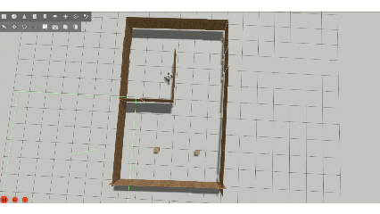
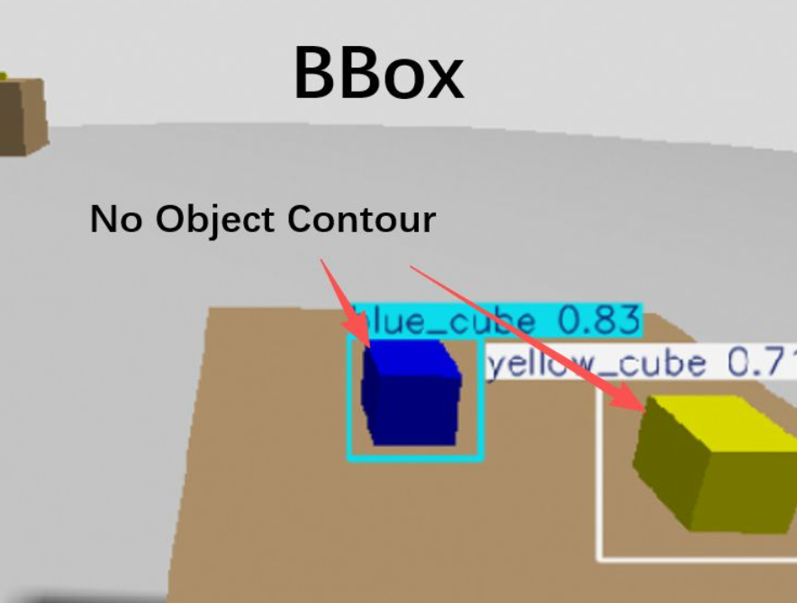
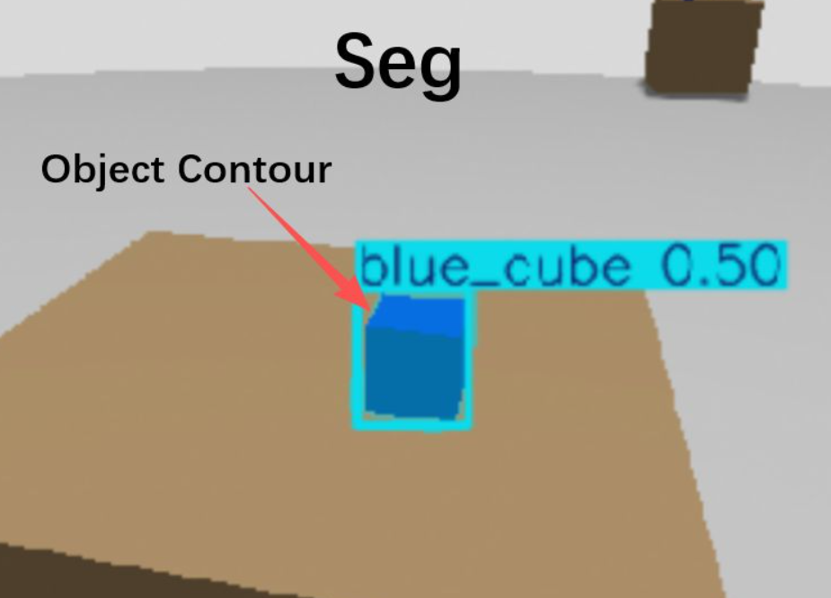
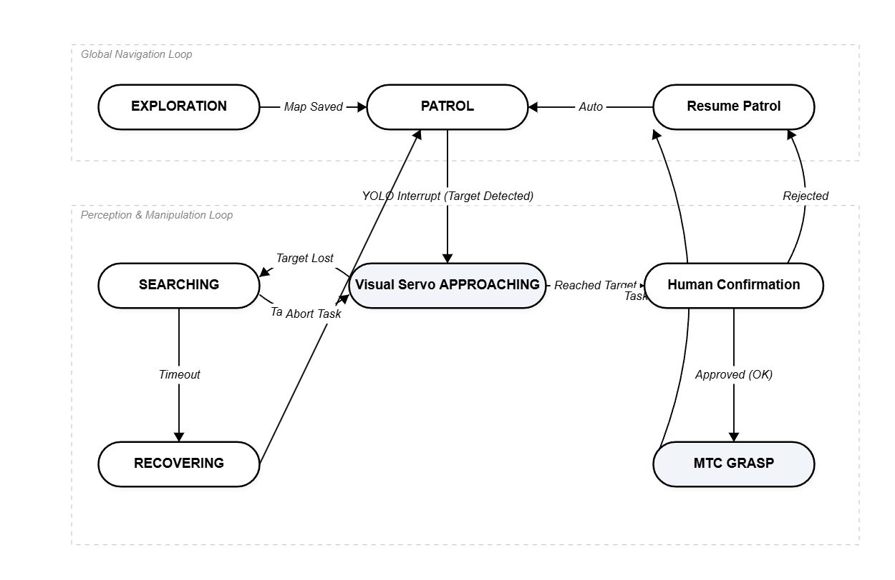

# 02 移动操作：导航、识别、抓取全链路闭环

## 这篇开始，机器人才算真的“要去做事”

如果上一篇解决的是“机器人怎么在未知空间里活下来”，那这一篇处理的就是另一个更难的问题：

机器人能不能在移动过程中看见目标、停下来、靠近它、把目标坐标稳定地交给机械臂，然后真的去抓。

这里难的不是某一个模块本身。  
你把 `Nav2` 单独拿出来，能跑。  
把 `YOLO` 单独拿出来，也能跑。  
把 `MoveIt2` 单独拿出来，理论上也能跑。

但真正难的是，把这几件事变成一条连续的工作流，而且这条工作流不是脚本里写死的顺序播放，而是一套会被现实打断、会切换状态、会失败、会恢复的系统。

这也是我真正开始觉得“移动操作”不是几个 demo 的叠加，而是系统工程的地方。

## 从“会探索”到“会找东西”，中间差的不是一点点

上一篇里，机器人最重要的任务，是扩展自己的已知空间。  
到了这一篇，目标变了。它不再只是去那些“值得探索的地方”，而是开始在探索和巡逻过程中，对具体物体产生反应。

这时候系统的核心矛盾就出现了：

- 导航希望持续向前，把地图跑完整
- 感知希望机器人停下来，给它一个足够稳定的观察窗口
- 抓取希望目标坐标尽量干净，不要飘，不要抖，不要一会儿在这儿一会儿在那儿
- 机械臂规划又希望底盘和环境别给它制造太多碰撞和 IK 麻烦

也就是说，从这一篇开始，系统不再只是“在空间里运动”，而是开始围绕一个任务目标重新分配注意力。

我一直都认可一个道理：我们设计任何服务人类的东西，都要人性化。所以我们设计机器人，设计各种有关机器人的流程，都要遵循一个道理：他能不能模仿人类？他能不能面对问题的时候像人类一样去解决处理这个问题？（当然这里目前为止肯定不能碰瓷让机器人像人一样思考）

所以机器人要学会一件很像人的事：  
本来在赶路，突然看见一个值得处理的东西，于是停下原来的计划，转去处理局部任务，处理完以后再决定要不要回到原来的主线。

这件事说起来很简单，真的做起来，状态管理会立刻变得很恶心。

## 我没有直接用 explore-lite，而是自己写了一个 pink_exploration

这里其实挺能说明真实工程和“开源包拼装”的区别。

很多时候，开源项目不是不能用，而是你不能把它当成可以直接落地到你当前系统上的成品。你最多能先拿它的思路，再判断哪些地方必须自己改。

我当时就遇到了这个问题。  
`explore-lite` 这种 frontier exploration 的思路本身没错，但它在我这个具体组合里，也就是 LeoRover 这种滑移转向四轮平台，加上当时的 `SLAM + Nav2` 闭环，耦合得并不稳定。

典型症状非常具体：

- frontier 目标看起来可达，实际导航失败
- 机器人在地图边缘反复试探
- 原地转动偏多
- 明明在探索，但进展很慢
- 某些长边界区域，探索点密度不合理，选点不够“贪”

也有可能我没深入优化。

所以我后来没有继续硬吃现成流程，而是自己写了一个类似 `explore-lite` 的探索节点，也就是 `pink_exploration` 这条线，这里看我的demo就知道我的探索是粉球球，explore-lite是绿球球。

它的思路很朴素，甚至有点土：

- 直接订阅 `/map`
- 把未知区和自由区分出来
- 对未知区域做膨胀
- 用未知膨胀边界和自由区域的交界提取 frontier
- 对长轮廓沿边界采样，不只取一个质心
- 在 RViz 里把这些候选 frontier 画成一串粉球
- 每次选择最近、当前最值得去的球去试

这就是为什么这个节点名字会变成一个很不“正式”的 `pink_ball_explorer`。  
因为在我的工作流里，那些 frontier 候选点最后真的就是一串粉球。

听上去有点草台，但它是有效的。  
更重要的是，它不是停留在“提一个 frontier 点”就结束了，而是把失败、超时、黑名单、后退恢复这些更烦人的事情一起纳进去了。

比如：

- 到一个点 15 秒还没搞定，就先判定为 stuck
- 当前目标失败了，就拉黑，不再反复撞它
- 脱困时不讲优雅，直接后退或者转向恢复
- 连续多次没有 frontier，才判断探索完成，避免过早结束

这类东西看起来不“高端”，但它们才是系统能不能连续工作的关键。
毕竟先让他有个结果嘛。

## 这套工作流真正的状态，不是“探索然后抓取”，而是不断切换

如果只用一句话描述这套系统，它可以被说成：

探索 -> 发现物体 -> 抓取 -> 结束

但实际运行不是这么线性的。

从代码层面看，它更像一个不断在几种状态之间切换的系统。

### 状态 1：探索

最开始是 exploration 阶段。机器人基于 frontier 不断给自己派目标，先把未知空间跑开。

这一阶段不是为了“赶紧找到目标”，而是为了让地图长出来，顺便生成后面巡逻要用的任务点和空间基础。

### 状态 2：巡逻

探索结束以后，系统会保存地图，然后切到 patrol 阶段。这个阶段已经不是单纯的 frontier 扫描了，而是基于已有任务点进行巡逻。

也就是说，系统从“扩展未知空间”切到了“在已知空间里执行任务”。

这里有一个很容易被忽略、但其实很体现系统意识的小点：  
我不是探索结束以后立刻粗暴切过去，而是先保存地图，再给一个倒计时桥接，让系统从 exploration phase 平稳切到 patrol phase。这个桥接动作很小，但很重要，因为它把“地图已经稳定到可以进入任务执行”这件事明确化了。

而且巡逻也不是随便按录入顺序乱跑。我在 patrol 里做了一个很朴素的路径顺序优化，按当前位置去贪心选择下一个更近的任务点（也就是做了最佳路径规划）。它当然不是严格的全局最优，但在这个项目里，这种局部最短路径重排已经足够把系统从“机械地巡逻”拉到“至少在任务层面有一点效率意识”。

### 状态 3：视觉打断

巡逻过程中，只要 YOLO 检测到目标物体，而且置信度过线，巡逻就会被打断。

这里必须坦诚一个设定：我并没有花费大量算力去训练一个泛化能力极强的 YOLO 模型，训练集极小，导致它其实是个‘极度近视’的模型。这并非偷懒，而是我故意的边界约束：我不需要一个能在 10 米外看清目标的上帝之眼，我需要的是在 1 米内极度稳定、能触发抓取状态机的可靠扳机。 在资源受限的个人项目中，搞清楚‘够用’的边界，比盲目追求单点 SOTA 更重要，当然如果你真有一个及其NB的模型，能准确识别你想要的，那我这为了近视眼设计的流程其实也就没那么重要了，但它仍然属于一个锦上添花的补丁。

这一步非常关键。  
我不是让视觉一直压着导航跑，而是让视觉在恰当时机抢占状态机。

换句话说，系统不是“边导航边抓取”，而是：

- 先导航
- 发现值得处理的物体
- 停掉当前导航目标
- 把控制权交给视觉迫近逻辑

这里已经不是简单 topic 连一连就行的问题，而是任务优先级在变。

### 状态 4：视觉迫近

进入视觉迫近以后，系统又会继续细分。

这一段在我的代码里其实很像一个小状态机：

- `APPROACHING`
- `SEARCHING`
- `RECOVERING`

如果目标稳定，就继续靠近。  
如果目标丢了，就开始搜索。  
如果判断前面被挡住了，或者距离不再收敛，就进入恢复模式，先退、再转、再找。

这部分我很喜欢，因为它终于不再是“理想条件下的一步到位”，而是开始有那种**真实系统的犹豫、试探和补救。**

而且这里面还有两个代码层面的精华点，单看演示视频其实看不出来。

第一个是目标锁定。  
视觉迫近时，画面里经常不只一个候选框，或者同一个目标的检测框会抖。为了避免控制逻辑在多个目标之间来回跳，我专门做了 sticky target lock。也就是说，一旦系统已经锁定某个目标，它不会因为下一帧出现了另一个“看起来也不错”的框就立刻换目标。这个小机制非常土，但能大幅减少伺服过程里的犹豫。

第二个是冷却时间。  
如果一次迫近失败，或者用户选择跳过，系统不会立刻重新因为同一个误检再被打断一次。我给不同结果分别加了冷却：

- 成功后短冷却
- 用户跳过后长冷却
- 目标丢失或失败后中等冷却

这个逻辑的本质不是“拖延”，而是防止系统在误检和局部失败里无限重入。

### 状态 5：人工确认后的抓取

当机器人已经靠得足够近，目标在画面里也足够稳定以后，系统不会直接一把梭执行抓取。  
它会停下来，等人确认。

这个设计不是因为我不想自动化到底，而是因为在这个阶段，**人机协同反而是更合理的工程选择。**

自动抓取看起来很帅，但如果代价是系统很脆、误抓率很高、每次失败以后整条链都崩，那它就只是一个脆弱 demo。

我想说：在这个具体项目阶段，人类是最后一道安全检查。你不能让它乱来啊！而且其实这样对你的测试有好处的，至少不会乱抓把东西抓飞。

## YOLO 到抓取目标，中间并不是“检测框直接变机械臂坐标”

很多人看这种系统时，会下意识把这一步脑补成：

检测到物体 -> 取中心点 -> 发给机械臂

但真正跑起来以后，你很快就会发现这一步如果做得太草率，机械臂抓取几乎等于随机。

我这里专门写了一个 `yolo_to_grasp_node`，它的作用不是单纯转坐标，而是把视觉结果尽量变成一个机械臂能吃的、稍微稳一点的目标。

中间至少做了几层处理：

- 从 YOLO 结果里拿中心点和 bbox
- 不再只采一个像素深度，而是优先在 bbox 中间区域采深度，避开边缘噪声
- 取中值深度，不吃单点异常值
- 把 2D 检测转换到相机 3D，再通过 `TF2` 变换到 `base_link`
- 对连续帧结果做 `EMA` 平滑
- 给坐标加人工校正偏移
- 如果目标消失，清掉缓存，避免系统抱着旧坐标不放
- 只有样本累计到一定程度，才允许把目标发给抓取链

这里其实非常不“学术”，但很“工程”。

而且这里还有一个我自己后来才真正吃透的点：
**模型选择本身，会直接改变抓取精度。**

我一开始其实图省事，直接用的是普通的 YOLO 检测框。
当时的直觉很简单：既然已经能检测出物体，那抓取坐标无非就是在 bbox 上再做一点几何变换，最多调调偏移就好了。

结果并不是这样。

普通检测框在“看见物体”这件事上够用了，但在“我要从哪里下手去抓这个东西”这件事上，它不够稳。
因为检测框天然更偏向语义包围，而不是几何中心。对于抓取来说，这两件事差一点都不行。你以为你只差几毫米，最后落到机械臂那里，抓偏就是抓偏。

我当时试过一段时间，靠不断调 offset 去补：

- 前后再伸一点
- 左右再偏一点
- Z 再抬一点

但怎么调都不彻底。
因为问题不只是“坐标有固定偏差”，而是输入本身就不稳定。你拿一个不够几何一致的框去做抓取，再怎么补都像在追一个一直在晃的目标。

后来我换成了 `YOLO-Seg` 这一路，抓取精度一下子就顺了很多。原因其实也不神秘：

- segmentation 给出的不是一个粗的外接框
- 我可以更自然地围绕目标区域去找更接近物体真实中心的落点
- 再配合质心估计、深度采样和偏移修正，最后输出的抓取点会稳定得多

说白了，普通 YOLO 更适合回答“这是什么”。
而在我这个仿真顶抓场景里，`YOLO-Seg` 更适合回答“我该抓它的哪里”。

当然，这里我也得说清楚：
**这一点主要是在仿真里成立，而且是对我这个特定抓取场景成立。**

我不想把它写成一个普遍真理。
它更像是一条很具体的工程经验：

- 如果你的目标是导航提示，普通检测框可能已经够了
- 但如果你的目标是把视觉结果直接喂给抓取链，几何中心和边界质量就会一下子变得非常重要

也正因为这样，我后来才更确定，视觉模型在机器人里不能只按 benchmark 选。
你得看它到底是拿来做“识别”，还是拿来做“动作入口”。这两个要求，很多时候根本不是一回事。

比如我代码里就直接保留了这种经验性修正：

- `EMA_ALPHA = 0.3`
- `offset_x = 0.01`
- 必须累计到 5 帧以上才算“稳定”

这些参数没有什么漂亮的理论外衣。它们更像是你看着系统一遍遍跑，发现“不加这个就不行”，最后慢慢留下来的手感。

我觉得这反而是这条链路里很真实的部分。  
机器人不是先有理论上的优雅，然后才走向工程；很多时候恰恰相反，是你先为了让它抓得到，做了一堆不那么优雅但有效的修正，后面再去慢慢总结。

还有一个很值钱但不显眼的点，是我会在目标彻底消失时主动清空缓存。  
这听起来像小事，但如果不这么做，系统就会继续抱着上一批坐标结果不放，视觉上目标已经没了，机械臂和迫近逻辑却还在相信“它还在那儿”。这类 bug 特别像鬼，但我没开过某车，也没见过某车的雷达在空无一人的停车场，扫描车身附近有人。

## 机械臂为什么要锁成 3DOF，这不是退步，是妥协

这一部分如果只看表面，很容易被误解成“怎么还把自由度做少了”。

但真实情况没那么简单。

在我这个特定场景里，抓取主要是顶抓，而且目标和底盘、相机、机械臂安装位置之间的关系非常固定。理论上全 6 自由度当然更完整，可一旦真的进 `MoveIt2 + MTC`，你就会发现另一个现实：

- IK 经常找不到解
- 某些姿态看起来合理，规划器却总觉得要撞
- 末端姿态要求一严格，整条抓取链的成功率就开始掉

所以我后来在真机约束下单独做了一个 `3DOF` 的配置：

- 只保留前三个关节做主运动
- 把 4 到 6 号关节当成 passive
- 用 `position_only_ik`
- 把 `eef` 和 `gripper_frame` 也切到更适合这个模式的位置
- 顶抓姿态要求也故意放弱

说白了，这是一种工程上的认怂。  
但它不是坏事。

因为在这个特定的顶抓场景下，我真正想要的不是“机械臂拥有理论上的完整自由度”，而是“它别整天卡在 IK no found，别让规划器每次都因为碰撞预判直接放弃”。

我处理场景，我要求你做到，而不考虑你怎么去做，你只要做到，抛开做的好不好，你至少做到了，而不是做不到。

这就是为什么我现在越来越不喜欢用“更强”这种词来描述机器人系统。  
很多时候，系统不是靠更强变稳定的，而是靠你承认场景约束，然后主动收缩自由度，换取一条可重复、可解释、能跑通的动作链。

这里其实还有一层更具体的妥协：  
为了让机械臂在这个安装结构上别总跟 RGB-D 相机的几何模型互相“吓唬”，我在碰撞矩阵上也放宽了机械臂和相机之间的一部分碰撞检查。因为在这个平台结构里，如果把所有几何都按最保守的方式硬算，规划器会过于胆小，最后表现得像是什么都不敢做。

这不是优雅解。  
但它是能工作的解。

而且这种妥协其实很有代表性：  
真实机器人里，很多成功不是来自“把全部可能性都保住”，而是来自“把那些当前根本不重要、却一直制造失败的自由度先收掉”。

当然后面我也想过如果把所有自由度解开来会不会神奇的好了，甚至夹爪那个关节他会和yoloseg配合去规划找个最合适的夹爪角度去抓...虽然也没试过~

提一嘴，如果我上真实硬件，我也许会直接放弃MoveIt2,用Mycobot里面自己的Ik包。我只考虑高效，没准上真机MoveIt2给你搞啥幺蛾子，mycobot里面自己的封装库可是随便搞的！

## 抓取这件事，到最后依然是一个全链路问题

就算你已经有了：

- 巡逻
- 检测
- 坐标变换
- 视觉迫近
- 机械臂规划

也不代表系统就自然闭环了。

因为最后决定这条链是否成立的，往往还是最具体的细节：

- 目标是不是在机械臂工作空间里
- 视觉坐标是不是足够稳定
- 底盘停下来的姿态是不是适合抓
- 相机和末端之间的空间关系是不是会制造虚假的碰撞
- 抓完以后，系统能不能回到一个可继续工作的状态，而不是抓一次就乱掉

我在 MTC 那边其实也做了很多很“现实”的处理：

- 把抓取姿态改成固定顶抓，不再追求花哨多解
- 先把碰撞物体加进 planning scene
- 抓取阶段允许 gripper 和目标物体发生预期碰撞，而不是假装抓取过程完全无接触
- 抓完以后先抬高，再回 `ready` 或安全关节位
- 如果命名目标回不去，就直接退回到一组保守 joint target

还有一个非常工程、但我觉得含金量挺高的细节：  
在真正执行分段轨迹之前，我会把每一段轨迹的起点**重新对齐到当前机器人关节状态**，而不是盲信规划时的那个起始点。因为只要系统是分阶段执行的，前一段执行完以后，真实状态和理想状态就有可能已经出现偏差。这个小修正的意义在于，它让整个抓取链不至于因为前面一点点误差积累，后面就直接错位。

这些东西放在论文摘要里都不重要，甚至有点琐碎。  
但如果没有它们，系统就只有“偶尔成功抓一次”的戏剧性，不会有“可以持续跑”的稳定性。

## 这一篇真正想表达的，不是我把多少模块接起来了

如果只从模块数量上看，这篇文章很容易被写成：

- 我接了 Nav2
- 我接了 YOLO
- 我接了 MoveIt2
- 我还做了 MTC

但这其实没什么意思。  
真正值得写下来的，是这些模块在一起以后，系统开始出现了“状态”。

它会：

- 探索
- 结束探索
- 保存地图
- 做阶段桥接，再切到巡逻
- 切换到巡逻
- 发现目标
- 打断当前导航
- 进入视觉迫近
- 锁定一个目标，而不是来回换目标
- 丢目标后重新搜索
- 被阻挡时恢复
- 根据结果进入不同冷却
- 到位后等待人工确认
- 抓取
- 再恢复到可继续工作的状态

## 写在这一篇的最后

如果第一篇写的是机器人怎么在未知空间里不迷路，那这一篇写的就是：  
**当它终于不再只关心“路”，而开始关心“东西”的时候，整个系统会突然复杂很多。**

这时候你会发现，所谓移动操作并不只是“移动底盘 + 一个机械臂”。  
它更像是一种持续的协商：

- 全局任务和局部机会之间的协商
- 导航和感知之间的协商
- 视觉不确定性和动作确定性之间的协商
- 自动执行和人工确认之间的协商

而我觉得，这种协商感，恰恰才是移动操作最真实、也最迷人的地方。

因为机器人到了这里，才开始有一点像是在“做事”，而不是只是在“展示自己会动”。

