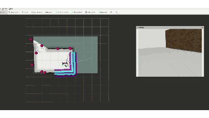
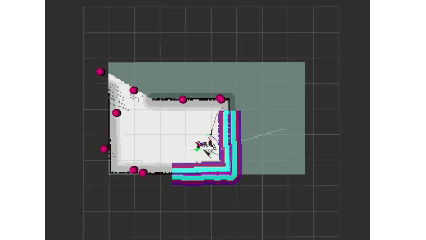

# 02 Mobile Manipulation: A Full Closed Loop of Navigation, Detection, and Grasping

## This Is the Point Where the Robot Finally Starts "Doing Something"

If the previous article was about how a robot survives in unknown space, then this one is about another, harder question:

Can the robot spot a target while moving, stop, approach it, hand a stable target coordinate to the robot arm, and then actually grab it?

The hard part here is not any single module by itself.  
Take `Nav2` on its own, and it can run.  
Take `YOLO` on its own, and that can run too.  
Take `MoveIt2` on its own, and in theory that works as well.

But the real difficulty is turning all of that into one continuous workflow, and not a workflow where the order is hard-coded in a script like a staged performance, but one that can be interrupted by reality, switch states, fail, and recover.

This was also the point where I really started feeling that mobile manipulation is not just a pile of demos stacked together. It is system engineering.

## The Gap Between "Can Explore" and "Can Find Things" Is Bigger Than It Looks

In the previous article, the robot's main job was to expand its known space.  
In this one, the target changes. It is no longer just going to places that are "worth exploring." Now it starts reacting to concrete objects while exploring or patrolling.

That is where the core tension in the system shows up:

- Navigation wants to keep moving forward and finish covering the map
- Perception wants the robot to stop and give it a stable viewing window
- Grasping wants the target coordinate to stay clean, not drift, not shake, not jump around from one moment to the next
- Arm planning wants the base and the environment not to create extra collision and IK trouble

In other words, from this article onward, the system is no longer just "moving through space." It starts reallocating attention around a task goal.

I have always believed one thing: if we design anything that serves people, it should feel human-friendly. So when we design robots and robot workflows, one question always matters: can it imitate how a person would deal with the situation? Can it respond to a problem in a vaguely human-like way? Of course I am definitely not claiming robots can think like humans right now.

But the robot does need to learn one very human-like behavior:  
it is on its way somewhere, then suddenly sees something worth dealing with, so it pauses the original plan, handles the local task first, and only then decides whether to go back to the original route.

This sounds simple when you say it out loud. Once you actually build it, the state management gets ugly very fast.

## I Did Not Use `explore-lite` Directly. I Wrote My Own `pink_exploration`

This part says a lot about the difference between real engineering and just "assembling open-source packages."

Most of the time, open-source projects are not unusable. The point is that you cannot treat them like ready-made products that drop straight into your own system. At most, you can borrow the idea first, and then decide what you have to rewrite yourself.

That is exactly the problem I ran into.

The frontier-exploration idea behind `explore-lite` is fine in itself, but in my specific setup, a skid-steer LeoRover plus the `SLAM + Nav2` loop I had at the time, the coupling was not stable enough.

The symptoms were very concrete:

- Frontier goals looked reachable but failed in real navigation
- The robot kept probing back and forth at the map edge
- Too much spinning in place
- It was technically exploring, but progress was slow
- In some long boundary regions, the frontier sampling density was not great, and the goal selection was not greedy enough

To be fair, maybe I did not optimize it deeply enough.

So instead of forcing the existing workflow to work, I later wrote my own exploration node along the same general idea, the `pink_exploration` line. If you look at my demo, you can tell immediately: my exploration uses pink balls, while `explore-lite` uses green ones.

The idea is very plain, honestly a bit rustic:

- Subscribe directly to `/map`
- Separate unknown space from free space
- Inflate the unknown region
- Extract frontiers from the boundary between inflated unknown regions and free space
- Sample along long contours instead of taking only one centroid
- Draw the candidate frontiers in RViz as a string of pink balls
- Each time, choose the nearest ball that currently looks most worth trying

That is why the node ended up with the very un-serious name `pink_ball_explorer`.  
Because in my workflow, those frontier candidates really do show up as a chain of pink balls.

It sounds a little improvised, but it works.  
More importantly, it does not stop at "propose a frontier point." It also brings in all the more annoying parts together: failure, timeout, blacklisting, backing up, and recovery.

For example:

- If a point still is not reached after 15 seconds, mark it as stuck
- If the current target fails, blacklist it instead of smashing into it again and again
- During recovery, do not chase elegance, just back up or turn and reset
- Only declare exploration finished after multiple consecutive checks with no frontier, so it does not end too early

None of that looks very "high-end," but those are exactly the things that decide whether the system can run continuously.
At the end of the day, first it needs to get some result.

## The Real State of This Workflow Is Not "Explore Then Grasp," but Constant Switching

If I had to describe the system in one sentence, I could say:

Explore -> find object -> grasp -> finish

But that is not how it actually runs.

From the code's point of view, it is much closer to a system that keeps switching between several states.

### State 1: Exploration

At the beginning, the robot is in the exploration phase. It keeps assigning frontier goals to itself and expands the unknown space.

The purpose of this phase is not "find the target as fast as possible." It is to let the map grow, and meanwhile generate the spatial basis and task points that later patrol will use.

### State 2: Patrol

After exploration finishes, the system saves the map and switches into patrol. At this stage it is no longer just scanning frontiers. It patrols based on the task points that already exist.

In other words, the system moves from "expand unknown space" to "execute tasks in known space."

There is one small thing here that is easy to miss but actually says a lot about system thinking:  
I did not switch over brutally the moment exploration ended. I saved the map first, then inserted a countdown bridge, so the system could move smoothly from the exploration phase into the patrol phase. It is a tiny action, but an important one, because it makes one thing explicit: the map is now stable enough to enter task execution.

And the patrol is not just random point-to-point replay in the order things were recorded. I added a very simple route-order optimization there: from the current position, greedily choose the next closer task point. It is obviously not a globally optimal solution, but in this project it is enough to move the system from "mechanically patrolling" to "at least having a bit of efficiency awareness at the task level."

### State 3: Visual Interruption

During patrol, as soon as YOLO detects a target object and the confidence passes the threshold, patrol gets interrupted.

I should be honest about one design choice here: I did not spend huge compute training some ultra-general YOLO model. The training set was tiny, and the result is basically an extremely short-sighted model. That was not laziness. It was a deliberate boundary. I do not need a god's-eye detector that can recognize targets from 10 meters away. I need a reliable trigger that is extremely stable within 1 meter and can switch the system into the grasping state machine. In a resource-limited personal project, understanding where "good enough" is matters more than blindly chasing single-point SOTA. Of course, if you already have a ridiculously strong model that can perfectly detect what you want, then this short-sighted design becomes less important. But it is still a useful patch on top.

This step matters a lot.  
I am not letting vision dominate navigation all the time. I am letting vision preempt the state machine at the right moment.

In other words, the system is not "navigating while grasping." It is:

- Navigate first
- Detect something worth dealing with
- Stop the current navigation goal
- Hand control over to visual approach logic

At this point, it is no longer a simple matter of wiring topics together. The task priority itself is changing.

### State 4: Visual Approach

Once the system enters visual approach, it gets split again into smaller internal states.

In my code this is basically a little state machine:

- `APPROACHING`
- `SEARCHING`
- `RECOVERING`

If the target is stable, keep approaching.  
If the target is lost, start searching.  
If something is blocking the way, or the distance stops converging, enter recovery, back up, turn, and try again.

I really like this part, because it is no longer a one-shot move under ideal conditions. It starts to have that feeling of a **real system hesitating, probing, and correcting itself.**

And there are two code-level details here that do not really show up in a demo video.

The first is target locking.  
During visual approach, the image often has more than one candidate box, or the same target box keeps shaking. To stop the control logic from jumping between targets, I added a sticky target lock. Once the system has locked onto one target, it does not instantly switch just because another box in the next frame also looks decent. This little mechanism is extremely simple, but it cuts down hesitation in the servo process a lot.

The second is cooldown time.  
If one approach fails, or the user chooses to skip, the system should not immediately get interrupted again by the same false detection. So I gave different outcomes different cooldown windows:

- Short cooldown after success
- Long cooldown after user skip
- Medium cooldown after target loss or failure

The point of this logic is not to "delay" things. It is to prevent the system from endlessly re-entering the same false detection or local failure loop.

### State 5: Grasping After Human Confirmation

Once the robot is close enough and the target is stable enough in the image, the system does not just fire off a grasp immediately.  
It stops and waits for a human to confirm.

That is not because I do not want full automation. It is because at this stage, **human-robot collaboration is simply the more reasonable engineering choice.**

Automatic grasping looks cool, but if the price is that the system becomes fragile, grabs the wrong thing too often, and the whole chain falls apart after each failure, then it is only a fragile demo.

At this stage of the project, the human is the final safety check. You cannot let the robot do whatever it wants. And honestly this also helps during testing. At least it will not fling objects away by grabbing recklessly.

## From YOLO to a Grasp Target Is Not Just "Turn the Detection Box Into Arm Coordinates"

When people watch systems like this, they often imagine this step as:

Detect object -> take center point -> send it to the arm

But once you actually run it, you quickly realize that if this step is done carelessly, the arm is basically grasping at random.

I wrote a dedicated `yolo_to_grasp_node` for this. Its job is not just to convert coordinates. Its real job is to turn visual output into something the arm can actually consume, and something at least a bit more stable.

There are several layers of processing in between:

- Take the center point and bbox from YOLO output
- Do not sample only one depth pixel, but prioritize the center area inside the bbox and avoid noisy edges
- Use median depth instead of trusting one outlier value
- Convert the 2D detection into camera-frame 3D, then transform it into `base_link` through `TF2`
- Smooth continuous frames with `EMA`
- Add manually calibrated coordinate offsets
- Clear the cache if the target disappears, so the system does not cling to stale coordinates
- Only allow the target to be sent to the grasping chain after enough samples have accumulated

None of this is very "academic," but it is very engineering-heavy.

And there was one point here that I only truly understood later:
**the model choice itself directly changes grasping accuracy.**

At first, to save effort, I simply used ordinary YOLO detection boxes.
The intuition was straightforward: if the object can already be detected, then the grasp coordinate should just be some geometric conversion on top of the bbox, maybe with a bit of offset tuning.

That is not what happened.

A regular detection box is good enough for "seeing the object." But it is not stable enough for "where exactly should I grab this thing."
Because a detection box naturally follows semantic coverage, not geometric center. For grasping, even a small difference there is enough to matter. You think you are off by only a few millimeters, but by the time that error reaches the arm, a bad grasp is still a bad grasp.

I spent some time trying to fix it just by tuning offsets:

- Reach a bit further forward
- Shift a bit more left or right
- Raise Z slightly

But no amount of tuning solved it completely.
Because the issue was not just "the coordinate has a fixed bias." The real issue was that the input itself was unstable. If you use a geometrically inconsistent box as grasp input, all your offset tuning does is chase a target that keeps wobbling.

Later I switched to `YOLO-Seg`, and grasping accuracy immediately became much smoother. The reason is not mysterious:

- Segmentation does not just give a rough outer box
- It lets me define a landing point more naturally around the actual target region
- Together with centroid estimation, depth sampling, and offset correction, the final grasp point becomes much more stable

To put it bluntly, ordinary YOLO is better at answering "what is this."
In my top-grasp simulation setup, `YOLO-Seg` is better at answering "where exactly should I grab it."

That said, I should also make this clear:
**this mainly holds in simulation, and mainly in my specific grasping setup.**

I do not want to write it as some universal truth.
It is more like one very specific engineering lesson:

- If your goal is navigation hints, ordinary detection boxes may already be enough
- But if your goal is to feed visual output directly into a grasping pipeline, then geometric center and boundary quality suddenly matter a lot

That is also why I later became more convinced that in robotics, visual models should not be chosen only by benchmark numbers.
You have to ask whether the model is being used for "recognition," or as an "action entry point." Those are often not the same requirement at all.

That is why I kept these experience-driven corrections directly in the code:

- `EMA_ALPHA = 0.3`
- `offset_x = 0.01`
- At least 5 frames must accumulate before the target counts as "stable"

There is no elegant theory wrapping those numbers. They are more like the feel you get from watching the system run again and again, noticing that "without this, it just does not work," and gradually leaving those parameters in place.

I actually think this is one of the most real parts of the whole pipeline.  
Robotics does not begin with theoretical elegance and then move toward engineering. Very often it is the other way around: first you make a pile of ugly but effective fixes so the robot can actually grab the thing, and only later do you step back and summarize what happened.

There is also one small but valuable detail here: I actively clear the cache when the target disappears completely.  
It sounds minor, but without that, the system keeps trusting the old coordinate batch. Visually the target is gone, but the arm and the approach logic still believe "it is still there." Bugs like that feel haunted.

## Why I Locked the Arm Down to 3DOF. It Is Not a Regression, It Is a Compromise

If you only look at the surface, it is easy to misunderstand this part as "why are you reducing the degrees of freedom."

But the real situation is not that simple.

In my specific setup, the grasp is mainly a top grasp, and the relationship between the target, the base, the camera, and the arm mounting position is very fixed. In theory, full 6DOF is of course more complete. But once you really put it into `MoveIt2 + MTC`, reality shows up very quickly:

- IK often fails to find a solution
- Some poses look reasonable to a person, but the planner keeps thinking they will collide
- Once the end-effector orientation requirement gets too strict, the success rate of the whole grasping chain starts to drop

So later, under real hardware constraints, I made a separate `3DOF` configuration:

- Keep only the first three joints for the main motion
- Treat joints 4 to 6 as passive
- Use `position_only_ik`
- Move `eef` and `gripper_frame` to positions that fit this mode better
- Deliberately weaken the top-grasp orientation requirement

To put it bluntly, this is an engineering version of admitting defeat.  
But that is not a bad thing.

Because in this specific top-grasp scenario, what I really want is not "the arm keeps its full theoretical freedom." What I want is "it stops getting stuck in IK no solution, and stops having the planner give up every time because of predicted collisions."

I care about whether the scenario gets handled. I care that you do it. I do not care that much how elegant the way is. Before talking about whether it is done beautifully, it first has to be done at all.

That is why I now like the word "stronger" less and less when describing robot systems.  
A lot of the time, systems do not become stable because they get stronger. They become stable because you accept the constraints of the scene, actively reduce the freedom, and trade that away for a motion chain that is repeatable, interpretable, and actually runnable.

There is also another very concrete compromise here:  
to stop the arm and the RGB-D camera geometry from constantly scaring the planner inside this mounting layout, I loosened part of the collision checking between the arm and the camera in the collision matrix. In this platform structure, if every piece of geometry is handled in the most conservative possible way, the planner becomes too timid and ends up looking like it is afraid to do anything at all.

This is not an elegant solution.  
But it is a working solution.

And honestly, this kind of compromise is very representative:  
in real robots, a lot of success does not come from preserving every possible degree of freedom. It comes from temporarily removing the degrees of freedom that are not important right now but keep causing failures.

Of course I have also wondered whether unlocking all the DOFs again might somehow magically make things better, maybe even letting the gripper joint work together with `YOLO-Seg` to plan a more suitable grasp angle. I have not actually tried that yet.

And one more practical note: if I were running this on real hardware, I might honestly skip `MoveIt2` altogether and just use the IK package that comes with MyCobot itself. I care about efficiency. If `MoveIt2` decides to throw a weird tantrum on the real robot, MyCobot's own wrapper library may end up being the more straightforward choice.

## In the End, Grasping Is Still a Full-Chain Problem

Even if you already have:

- Patrol
- Detection
- Coordinate transforms
- Visual approach
- Arm planning

that still does not mean the system automatically closes the loop.

Because what usually decides whether the chain really works is still the most concrete details:

- Is the target actually inside the arm workspace
- Is the visual coordinate stable enough
- Is the base stopped in a pose that is suitable for grasping
- Does the spatial relationship between camera and end effector create fake collisions
- After grasping, can the system return to a state where it can keep working, instead of falling apart after one attempt

I also did a lot of very practical handling on the MTC side:

- Fix the grasp pose to a top grasp instead of chasing fancy multi-solution behavior
- Add the grasped object into the planning scene first
- Allow expected collisions between gripper and target during the grasping stage instead of pretending grasping is contact-free
- After grasping, lift first, then return to `ready` or a safe joint target
- If the named target cannot be reached on the way back, fall back directly to a conservative joint target

There is also one very engineering-heavy detail here that I think has a lot of value:  
before executing the segmented trajectory for real, I realign the start point of each segment to the robot's current joint state, instead of blindly trusting the starting state from planning time. As long as a system executes in stages, the real state after one segment can already drift away from the ideal state. This tiny fix matters because it stops the whole grasp chain from getting misaligned just because a small amount of error accumulated earlier.

None of these things matter in a paper abstract. Some of them even sound trivial.  
But without them, the system only has the drama of "it successfully grasped once in a while." It does not have the stability of "it can keep running."

## What This Article Really Wants to Say Is Not Just How Many Modules I Hooked Up

If you only count modules, this article could easily be written as:

- I used Nav2
- I used YOLO
- I used MoveIt2
- I used MTC

But that is not very interesting.  
What is actually worth writing down is that once these modules are put together, the system begins to have something like "state."

It can:

- Explore
- Finish exploring
- Save the map
- Bridge between phases and switch into patrol
- Patrol
- Detect a target
- Interrupt the current navigation
- Enter visual approach
- Lock onto one target instead of bouncing between multiple targets
- Search again after target loss
- Recover when blocked
- Enter different cooldowns depending on the result
- Wait for human confirmation once it is in place
- Grasp
- Return to a state where it can keep working

## At the End of This Article

If the first article was about how a robot avoids getting lost in unknown space, then this one is about this:

**Once the robot stops caring only about "the road" and starts caring about "things," the whole system suddenly becomes much more complicated.**

At that point you realize mobile manipulation is not just "a moving base plus a robot arm."  
It is more like an ongoing negotiation:

- A negotiation between the global task and local opportunities
- A negotiation between navigation and perception
- A negotiation between visual uncertainty and action certainty
- A negotiation between automatic execution and human confirmation

And to me, that feeling of negotiation is exactly what makes mobile manipulation both the most real and the most interesting part.

Because this is the point where the robot finally starts to feel like it is actually **doing something**, instead of just **showing that it can move**.

