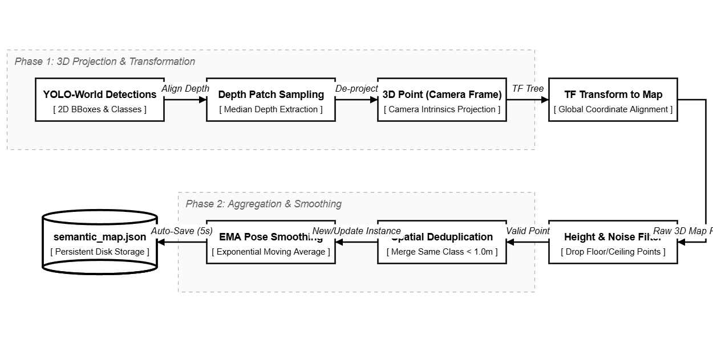
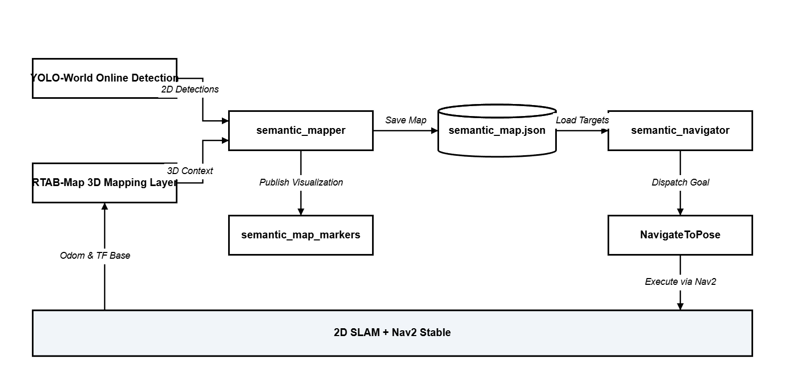

# 04 路线 A：基于 YOLO-World 的物体级在线打标导航

## 第二卷从这里开始，语义终于第一次落到地图上

如果前两篇解决的是“机器人能不能稳定地活下来”和“它能不能把移动、视觉、抓取串成任务链”，那从这一篇开始，问题开始变了。

这一篇不再只关心机器人能不能动，或者能不能抓。  
它开始关心另一件事：

**机器人能不能知道，地图里的某个位置，不只是“那里可以去”，而是“那里有一个具体的东西”。**

这就是我为什么把这一条路线放在第二卷的开头。

因为从这里开始，语义第一次不再只是屏幕上的检测框，不再只是图像里的标签，而是开始被压进一个稳定的空间坐标系里。

也就是说，机器人不再只是知道：

- 哪里有墙
- 哪里是空地
- 哪里可以导航

它开始尝试知道：

- 哪里有绿色垃圾桶
- 哪里有棕色木柜
- 哪里有 dining table
- 哪些是同一个物体，哪些不是

这一步看起来像只是“多加了一层标签”，但系统层面其实是质变。  
因为一旦语义能落到地图上，导航就不再只是去一个几何目标点，而是可以去一个**有名字、有类别、有空间含义的目标点**。

## 这条路线的气质，和后面的 RAG 路线完全不一样

我在 `00` 里就说过，第二卷要比较的是几种完全不同的语义导航范式。

这一篇对应的是最“硬”、也最确定的一条：

- 先检测具体物体
- 再把物体投到 map 坐标里
- 最后让导航系统直接去那个坐标

它的气质非常像经典机器人学和现代视觉模型的一次握手。  
视觉模型负责回答“这是什么”，经典机器人栈负责回答“它到底在地图的哪里”。

这条路线最迷人的地方在于它不玩虚的。  
它不是说“我大概记得这个场景像哪里”，也不是说“模型觉得目标可能在左边”。  
它更像是在认真做一张对象分布图：

- 这个垃圾桶在 `(x, y, z)`
- 那个柜子在 `(x, y, z)`
- 这个 table 不是刚刚那个 table

所以如果你让我用一句话概括这条路线，它其实就是：

**把开放词表视觉，变成一个可持久化、可查询、可导航的对象级世界模型。**

## 真正的关键，不是 YOLO-World 本身，而是它怎么被压进整个闭环

如果只是单独跑一个 `YOLO-World` 检测 demo，这件事当然没什么意思。  
你最多只能证明：模型能在图里认出一些你给它的词。

我真正想做的，**不是“让机器人会看见”，而是让它把“看见”接进整个系统。**

我最后这条工作流，实际状态大概是这样：

### 状态 1：先有一条稳定的 2D 空间闭环

这一步还是老规矩，底层先让 `SLAM + Nav2` 站稳。  
没有这个前提，语义根本没有可靠落点。

这一点其实特别重要，因为我在这里没有让 3D 视觉建图去抢 2D 导航闭环的话语权。  
我保留了一条很克制的设计：

- 2D 地图和导航主链，继续由原来那套稳定工作流负责
- RTAB-Map 主要承担 3D 视觉建图和可视化层
- 在 hybrid mapping 里，我甚至明确让 RTAB-Map 不去发布 `map -> odom` 的 TF

说白了，我不想为了多一层 3D 语义，就把原来已经稳定的 2D 行动闭环重新搞乱。

这其实就是这一条路线很典型的工程哲学：  
**语义层要尽量叠加在稳定空间层上，而不是反过来破坏它。**

这里其实还有一个经常会被误解的点：  
既然我已经有了 3D 建图和 3D 语义，为什么主导航栈还坚持用 2D？

原因不复杂，因为在我这个项目阶段，机器人真正持续在做的事情，依然是地面移动机器人最经典的那一套：

- 平面内定位
- 平面内避障
- 平面内路径规划
- 在未知环境里持续往前推进

对于这种任务形态，2D 栈并不是“落后”，而是更成熟、更稳定、调试成本也更可控。  
我不是没想过直接让 3D 成为主导航栈，只是很快就意识到，在这个阶段那样做，系统复杂度会陡增，但未必真的换来同等比例的收益。但是这绝对不是得过且过的意思哦！这叫最小成本实现！

所以我最后的判断是：

- 2D 继续做主行动闭环
- 3D 负责补足 2D 不擅长表达的东西

比如对象高度、空间外观、语义锚点、场景级记忆，这些都是 2D 地图天然表达不好的；但要让机器人今天就稳定地在平面环境里跑、避障、探索，2D 又明显更合适。

换句话说，3D 在这里不是没用，恰恰相反，它很有用。  
只是它的价值，不一定要体现在“立刻替代 2D 导航”这件事上。

我后来越来越接受一种更务实的分工方式：  
**2D 负责让机器人持续活着，3D 负责让机器人开始看懂更多。**

而且这件事到了后面会变得更明显。  
比如当 2D 定位被严重破坏，机器人出现那种很典型的“绑架问题”时，3D 地图和视觉重定位的价值就会突然变大。那时候它不再只是一个好看的语义层，而会开始变成恢复系统全局一致性的关键线索。

所以这一篇里，我没有让 3D 抢导航主链的位置；但这不意味着 3D 只是陪衬。  
更准确地说，它在这里先以一种比较克制的方式进入系统，等到后面讲鲁棒性和绑架恢复的时候，它的分量会一下子上来。

### 状态 2：并行启动 3D 视觉记忆层

在 hybrid 路线里，我会并行拉起 RTAB-Map，让它去做 3D 视觉建图、点云和数据库积累。

这里我很喜欢的一点是，这条链并不莽。  
我没有让 RTAB-Map 直接接管所有地图解释权，而是让它在 ground robot 的约束下尽量老实：

- `Reg/Force3DoF = true`
- `publish_tf = false`（mapping 阶段）
- `Mem/IncrementalMemory = true`
- `Grid/3D = true`

这些参数背后的意思其实非常明确：  
我需要 3D 语义层，但我不允许它把整个系统拽离地面。

### 状态 3：YOLO-World 接管“我想看什么”

这条路线真正跟普通 YOLO 检测不一样的地方，是我在 launch 里保留了运行时传词表的能力。

也就是说，这里不是把模型训练死在固定类别上，而是把“我现在想让机器人看什么”变成了一个运行时可以切换的开放词表输入。

比如我在默认类表里就放过这些词：

- `brown wooden cabinet`
- `window`
- `green trash can`
- `dining table`
- `large grey table`
- `bed`
- `bookshelf`

这件事本身其实就很有意思。  
因为从这里开始，机器人不再只是执行一套固定 label 的工业视觉任务，而开始带有一点“按语义意图观察世界”的味道。但仍然有一些小作弊的意思，因为该词表要基于我们测试的地图里面的东西，要不然yoloworld谁也不认或者谁都认，但你可以理解成，提前给机器人打好“你将去的地方有这些东西，请注意了”预防针。

### 状态 4：semantic_mapper 开始把 2D 检测结果压成 3D 对象

这里才是真正的精华所在。

我写的 `semantic_mapper.py` 并不是一个“收到检测结果就顺手记一下”的小工具，它实际上是这一整条 route A 的心脏。

它做的事情很具体：

- 订阅 `/yolo/prediction/item_dict`
- 同时拿深度图和相机内参
- 把 2D 中心点转到相机 3D 坐标
- **再通过 `TF2` 变换到 `map` 坐标**
- 过滤掉明显不靠谱的点
- 做去重和平滑
- 最后把结果持久化成一个 JSON 语义地图

这条链看上去没有什么“炫技”时刻，但我觉得它是全篇最有含金量的地方。  
因为从这里开始，YOLO-World 终于不再只是图像理解模型，而开始参与**空间世界建模**。

## 我不是简单把 bbox 中心往地图里一扔

很多人会以为这一步就是：

识别到一个物体 -> 取中心点 -> 转换一下坐标 -> 完事

但如果真这么做，这张语义地图很快就会充满垃圾数据。

我在 `semantic_mapper.py` 里其实做了不少很不显眼、但很关键的约束。

### 1. 先过置信度，再谈语义

我先给检测结果做了一层置信度门槛，默认 `min_confidence = 0.4`。

这不是一个多漂亮的数字，它只是很朴素地回答一个问题：  
如果你自己都不太确定看见了什么，那就别急着把它写进地图。
更何况我的仿真环境是及其真正意义抽象的世界（类似Minecraft），而不是真实世界。想象一下你要把一个小猫形状的饼干识别成小猫，虽然荒谬，但是这是yoloworld要在仿真世界做的事情。

### 2. 深度不是取一个点，而是取一个小窗口的中值

我没有生硬地拿中心像素对应的一帧深度就相信它。  
我在中心点附近取了一个小的深度 patch，然后只保留有效深度，再取中值。

这件事听上去很细，但它决定了系统到底是在“记地图”，还是在“记噪声”。

因为你只要真做过 RGB-D 投影就会知道，边缘、反光、缺测、穿模，这些东西都能让单点深度显得像开玩笑。

### 3. 我在 3D 世界里做了第二层过滤

就算 2D 检测过了，深度也不代表一定可信。  
所以我在投到 map 以后，又做了一层空间过滤：

- 太近的不记
- 太远的不记
- 太低的，比如接近地面的假点，不记
- 太高的，比如天花板或远处墙面，也不记

这一层其实是在回答一个很朴素的问题：  
机器人不是在建一个哲学意义上的“万物词典”，而是在建一个对它行动有意义的对象地图。

### 4. 我没有把每次新检测都当成新物体

这也是我特别设计而且喜欢的一点。

如果同一个柜子你走过三次，每次都往 JSON 里记成一个新对象，那这张语义地图很快就会毫无可信度。  
所以我做了一层很直接的实例级去重逻辑：

- 只有同类物体才互相比较
- 如果新的 3D 点离已有同类实例小于 2 米，就先假设它们是同一个物体
- 然后用一个很简单的 EMA 去平滑这个对象的位置

这套逻辑一点都不“学术”。  
但它非常像真实系统该做的事：  
你不需要完美的 object tracking，你只需要先别把世界记得越来越乱。

### 5. 我保留了多实例，而不是把同类物体全糊成一个

反过来，如果它不是同一个物体，我也不会为了省事把所有 cabinet 都记成一个 cabinet。

我会给新实例加后缀：

- `brown wooden cabinet_1`
- `brown wooden cabinet_2`
- `green trash can_1`

这就让这张地图第一次开始有了一点“对象数据库”的样子，而不是一个扁平标签表。

### 6. 语义地图不是临时变量，而是会落盘

这一步我觉得也很重要。

我没有把这条语义链做成“开着节点时看起来很热闹，关了就没了”的即时效果。  
`semantic_mapper` 会每隔几秒保存一次，把结果写进 `semantic_map.json`。

这意味着这条路线的目标，从一开始就不是“做一个视觉秀”，而是：

**构建一张会留下来的语义地图。**

## 这一条路线最强的地方，是确定性

我后来越来越觉得，Route A 的最大魅力，不是它最“聪明”，而是它最确定。

它非常适合回答这种问题：

- 去绿色垃圾桶那里
- 去 dining table 附近
- 去那个 cabinet 旁边

因为在这条路线里，这些目标最后都尽量会被压成一个明确坐标。

这和后面 RAG 路线很不一样。  
RAG 更像是在说：“我记得这个场景像哪里。”  
而这一条路线更像是在说：“这个对象就在这里。”

这种确定性非常有力量。  
因为一旦它成立，整个导航系统就会显得特别干净：

- 先找对象
- 再拿对象坐标
- 再把坐标送给 Nav2

这几乎是最符合经典机器人直觉的一种语义导航。

## 但这条路线也有自己的边界

我不想把它写成一条无敌路线。  
它很强，但它的边界也很明确。

### 1. 它依赖检测词表和对象可见性

如果目标本身就不容易被检测到，或者词表没覆盖到，或者你从来没有从一个合理角度看见过它，那这张对象地图就不会凭空长出来。

### 2. 它本质上还是“对象中心导航”

这意味着它更擅长处理：

- 柜子
- 垃圾桶
- 桌子
- 窗户

这种可命名、相对稳定的对象。

但如果你的指令是：

- 去刚才那个很乱的地方
- 去像餐区一样的角落
- 去那个靠近床但不是床旁边的位置

它就没那么自然了。

### 3. 它对几何质量比对语言能力更敏感

这条路线真正脆弱的地方，往往不是“模型不懂词”，而是：

- 深度是否稳定
- TF 是否稳定
- 3D 投影是否靠谱
- 去重逻辑是否过于粗或过于敏感

所以它虽然看起来像一条“AI 路线”，但真正决定它上限的，依然有很大一部分是经典空间几何。

## 这条路线完整跑通以后，系统状态是什么样的

我觉得这一点必须写清楚，因为这条路线不是“一个节点”，而是一整条工作流。

它完整运行起来，大概是这样：

1. 底层先有稳定的 2D 建图导航闭环
2. hybrid mapping 并行启动 RTAB-Map 3D 层，但不抢主 TF
3. YOLO-World 根据当前开放词表开始在线检测
4. `semantic_mapper` 持续把检测结果投到 `map` 坐标
5. 系统在 RViz 中发布语义 marker
6. 语义对象持续去重、平滑、落盘到 `semantic_map.json`
7. 当 mapping 阶段结束后，这张对象地图可以被后续导航直接消费
8. `semantic_navigator` 读入这张地图，根据输入指令做目标匹配，再调用 `NavigateToPose`

这里这条路线虽然已经带语义了，但它的控制流依然很朴素。

它没有假装自己是一个“会推理一切”的通用大脑。  
它只是把一张普通地图，升级成了一张带对象锚点的地图。

这也是为什么我把它叫作第二卷的 Route A。  
因为它最像“语义导航的经典派”：

- 先有空间
- 再有对象
- 然后对象变成导航锚点

## 写在 Route A 的最后

我很喜欢这条路线，不是因为它最前沿，而是因为它很诚实。

它不试图一上来就让机器人拥有模糊记忆、开放推理或者复杂常识。  
它只是先做一件特别硬的事：

**把“这个世界里有什么”压成“地图的哪里有什么”。**

这件事一旦成立，机器人对世界的理解就第一次从几何地图，长成了对象地图。

我觉得这是一个很关键的台阶。  
因为它意味着机器人不再只是知道自己能去哪，而开始知道自己是去找什么。

而下一篇，我就会写另一条完全不同的路线。  
那条路线不再执着于把对象压成确定坐标，而是开始让机器人记住场景、记住描述、记住“我好像来过这里”。

也就是从对象级世界，走向场景级记忆。

再提一嘴，yoloworld认出来的东西仍然在仿真世界不可能完全准确，但好在你可以把那份地图Json文件拿出来照着3D地图上面的标记点改，改成你想要的标记。这也是一种不错且精准的实现方案。

