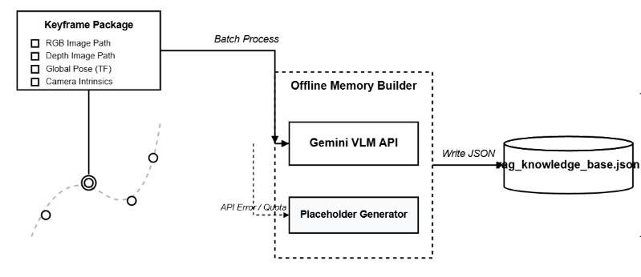
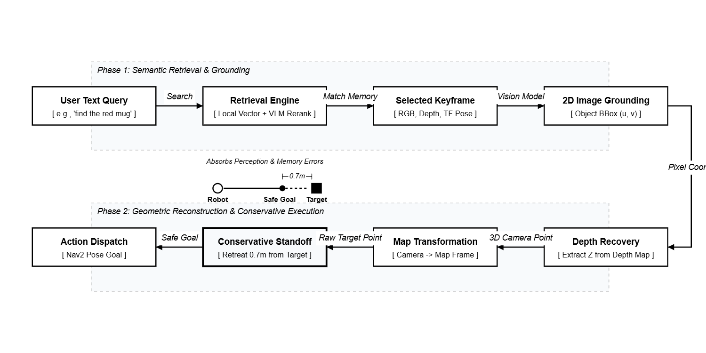
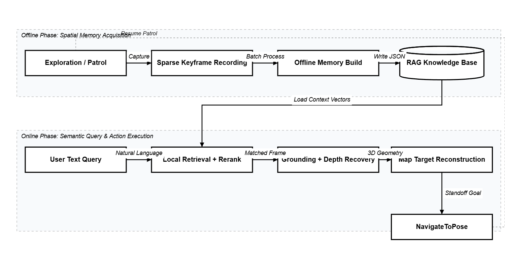

# 05 路线 B：基于 LLM 关键帧分析与 RAG 检索的场景记忆导航

## 如果说上一条路线是在记物体，这一条路线更像是在记场景

写完 `03` 以后，我自己越来越清楚一件事：  
语义导航其实并不只有一条路。

写在前面：这条路线仍然处于探索阶段，仍然需要优化。但它成功实现了我心里预期的80分，所以提供了一定的可行思路。

上一条 Route A 的逻辑非常硬，也非常经典。它会努力把世界压成一张对象分布图：

- 这个 trash can 在哪里
- 那个 cabinet 在哪里
- dining table 在哪里

然后导航系统就直接朝那个坐标去。

但我后来慢慢觉得，真实的人并不总是这样记路的。  
很多时候，我们记住的不是“某个物体的精确坐标”，而是“我来过这个地方”，“那个地方旁边有一张乱桌子”，“那个角落看起来像吃饭区”，“我记得绿色垃圾桶是在一面墙边上”。

也就是说，Route A 更像是对象级地图。  
而这一篇要讲的 Route B，更像是场景级记忆。

它不再执着于先把每个目标都稳定压成一个长期存在的 object anchor。  
它换了一个思路：

- 先让机器人在探索过程中记住一些关键画面
- 再让多模态模型离线分析这些画面
- 把这些画面连同它们的位姿、深度和语义描述存成一套可检索的记忆
- 真正导航时，不是直接问“物体坐标在哪”，而是先问“我有没有见过你说的那个场景”

这个思路听起来更像人，也更像记忆，而不是数据库。

## 这条路线真正迷人的地方，是它允许模糊

我为什么后来会想做这条线，其实原因很简单。  
Route A 虽然得体，但它太要求目标是“可命名、可检测、可稳定投影”的对象了。

可现实里很多指令不是这么干净的。

比如：

- 去刚才那个很乱的桌子那儿
- 去书架旁边
- 去那个有绿色垃圾桶的角落
- 去我记得像餐区的地方

这些描述有时候带对象，有时候带关系，有时候甚至更像一种印象。  
你很难把它们一上来就压成“一个 object label + 一个固定坐标”。

所以 Route B 的气质跟 Route A 完全不一样。

Route A 在说：
**“这个目标就在这里。”**

Route B 更像是在说：
**“我记得我见过一个很像你说的地方，我先把那一帧找出来，再从那一帧里把目标抠出来。”**

它没有前一条路线那么确定，但它明显更有“记忆”和“联想”的味道。

## 真正的关键，不是大模型有多聪明，而是我没有让它直接接管导航

这件事我后来越来越克制。

我并没有把这个系统做成“用户一句话进去，LLM 直接吐一个 `(x, y, yaw)` 出来，然后机器人开过去”那种很唬人的样子。（但如果真能做到，那我真是手搓光刻机了，平民搞了真正的端对端）
因为那种做法看着炫，但一旦你认真想想，就会发现里面缺了最关键的一层：**几何落地**。

所以我最后这条链路的设计很明确：

- 语言理解负责检索记忆
- 视觉 grounding 负责在记忆画面里重新找目标
- 深度与相机模型负责把像素变成 3D 点
- 保存下来的位姿与变换矩阵负责把 3D 点重新拉回 `map`
- 最后仍然交给 `Nav2`

也就是说，这条路线虽然带 `LLM / VLM / RAG`，但最后依然没有绕开经典机器人那套最硬的东西：

- 深度
- 内参
- TF / 位姿
- 2D 导航

这很重要。  
因为这意味着它不是一个“纯语言幻觉系统”，而是一个把记忆重新压回几何世界的系统。

## 状态 1：机器人先在探索过程中录关键帧，但不是把视频全录下来

我很不喜欢那种把整段视频全塞进记忆库的思路。  
那样当然简单，但没什么工程克制，而且后面检索和构库都会非常脏。

所以我自己写的 `keyframe_recorder.py` 一开始就不是录像机，而是**稀疏关键帧采样器**。
（当然这关键帧的采取也需要不断的优化，要不然“关键”根本就不关键）

它大概做了这几件事：

- 同时等 RGB、Depth、CameraInfo 都就绪
- 先检查 RGB 和 Depth 的时间戳是否真的同步
- 再去取当前 `map <- camera_frame` 的 TF
- 只有当机器人相对上一次记录点，平移超过阈值或者转角超过阈值时，才存一帧

这里的阈值也不是摆设，我默认就是按这种逻辑收：

- 位移大约 `1.0m`
- 朝向变化大约 `45 deg`
- RGB/Depth 同步容忍 `0.2s`

这个设计背后的意思其实很明确：  
我不要“所有画面”，我要的是**有空间增量的记忆切片**。

因为如果一台机器人在原地轻微晃了几下，你把十几张几乎一样的画面都记进去，那后面的记忆库很快就会变成重复垃圾。  
而如果它真的往前走了一米，或者确实换了一个看世界的方向，这一帧才值得被留下来。

另外一个我很喜欢的细节是，它存下来的不只是图片。

每一帧我都会一起保存：

- RGB 图
- depth `.npy`
- pose json
- 相机内参
- `transform_map_from_camera`

这就意味着，它不是“拍了一张照片”，而是“在某个世界位姿上拍到了一张可重新投回地图的照片”。

这点对后面太重要了。  
因为如果没有这层几何锚点，所谓记忆库最后只会变成一个图文检索玩具，而不是导航系统。

## 状态 2：离线构库时，我不是让模型写散文，而是逼它写结构化记忆

关键帧录完以后，我没有直接在线边走边调大模型。  
我把这件事拆开了，后处理到离线脚本里。
这里的离线，不是指断网，而是断开小车大脑让他歇歇！把东西送给别人的大脑让它帮忙分析。也就是把这些关键帧送给比较便宜的VLM进行分析。

`build_rag_memory_offline.py` 这部分其实就是整条链路的“记忆整理器”。

它会把完整的关键帧三件套找出来：

- `frame_xxxxxx.jpg`
- `frame_xxxxxx_depth.npy`
- `frame_xxxxxx_pose.json`

然后一帧帧送去便宜的VLM做场景分析，当然我后来发现其实现在的VLM也不贵...

但这里我没有让模型随便输出一段 prose。  
相反，我在 prompt 里逼它回严格 JSON，大概要求它给出三类东西：

- `objects`
- `scene_summary`
- `navigation_landmarks`

这一步我觉得特别关键。  
因为一旦你让VLM模型自由发挥，记忆库后面几乎不可控。今天它说“a cluttered dining corner”，明天它说“messy table area near wall”，后天又换另一种说法，最后你本地检索就会被各种表述漂移搞得很痛苦。

所以我更愿意让它像在给机器人写笔记，而不是在给人类写文学描写。

每条记忆最后会带上：

- 这张图的路径
- 对应深度路径
- 对应 pose 路径
- 相机位姿
- 相机内参
- 场景描述 JSON

最后落成一整个 `rag_knowledge_base.json`。

这里还有一个很真实、我反而愿意写出来的点。  
这套构库脚本不是假装 API 永远在线的。  
如果模型接口不可用，它会回退成 placeholder description，而不是整条流程直接报废。

这其实挺工程的。  
因为我做的不是论文插图，而是一条你真想**反复跑时还能活下去的流程。**  
接口偶尔抽风、免费额度不稳、网络不稳，这些都不是“异常”，而是日常。

所以这条路线从一开始就不是建立在“云端永远可靠”的幻觉上。

## 状态 3：真正检索时，我不是让大模型直接拍脑袋选答案

`rag_navigator_node.py` 里真正有味道的地方，我觉得不是“接了 Gemini”，而是我没有把检索这件事写得太天真。

它的完整思路其实是分层的。

### 第一层，本地先做一个很朴素的 lexical ranking

我先把每一帧的内容压成一个可搜索文本：

- `frame_id`
- `scene_summary`
- `navigation_landmarks`
- objects 的名字、属性、相对位置

然后先做一轮本地打分。

这听起来一点也不 fancy，但非常重要。  
因为它把候选空间先压小了，不需要每次都把整库完全扔给远端模型。

更重要的是，我在这里还加了一个很小但很有用的东西：**relation-aware boost**。

也就是如果 query 里出现类似：

- near
- next to
- beside
- 附近
- 旁边

而且句子里提到了两个实体，那么排序时会更偏向那些同时出现两个实体的帧。

这件事看着小，实际上非常对味。  
因为 Route B 最迷人的地方，本来就不是“单物体命中”，而是“场景关系检索”。

### 第二层，再让模型在压缩过的候选里选最像的一帧

本地召回以后，我再把 top-k 候选压成一份更紧凑的描述，丢给 Gemini 做一次 rerank。

注意，这里我也没有把原图一股脑扔进去让它重新看世界。  
我让它做的是更窄的工作：

- 用户说的目标是什么
- 这几个候选 frame 哪个最像
- 只回一个 `frame_id` 和一个分数

这比“让模型负责一切”要稳得多。  
因为它只是在你已经做过一轮本地召回以后，负责最后一小段语义 disambiguation。

再说白一点，这里模型的角色更像“最后拍板的人”，而不是“从零开始想象世界的人”。

### 第三层，还要做 anti-shake，不然终端输入都能把系统抖死

这块是很代码味、也很系统味的地方。

我给 query 处理专门加了几层限制：

- `query_cooldown_sec`
- `repeat_query_block_sec`
- `api_min_interval_sec`

这几个东西一点都不酷，但很值钱。  
因为你只要真的把终端输入接到一个会调远端 API、还会发导航目标的系统上，就会立刻发现，重复输入、手抖回车、连续问同一句，都会把整条链搅乱。。。我是个穷学生。

所以 Route B 不是“用户随便聊聊天，机器人就自然理解”。  
它实际内部是很克制地在防抖、防重复、防 API 过快触发。

## 状态 4：检索到关键帧以后，事情还远远没结束

我觉得这一步是整条路线最容易被误解的地方。

很多人一听到“RAG 导航”，会自然想成这样：

用户一句话 -> 找到最相关关键帧 -> 直接去那张关键帧的相机位姿

但我后来发现，这样其实很粗。  
因为你要去的通常不是“拍那张照片时相机待的地方”，而是**照片里那个你想找的东西所在的位置**。

所以我后面又补了一层非常关键的动作：  
**在被检索出来的记忆画面里，再做一次 grounding。**

也就是说：

1. 先从记忆库里选出最相关的一帧
2. **再对这张 RGB 图问一次：“你说的目标在图里哪个像素附近？”**
3. 拿到 `(u, v)` 或 bbox 以后，再去深度图里取这个目标的深度
4. 再把这个像素点反投影成相机坐标下的 3D 点
5. 再用保存下来的 `transform_map_from_camera` 把它变回 `map`

这一下，Route B 的性质就完全变了，很美丽。  
它不再是“导航到一张记忆照片”，而是“通过记忆照片恢复目标在地图里的位置”。

我觉得这一步特别值钱。  
因为它说明这条路线虽然很像 AI memory demo，但它最后还是认真回到了机器人最硬的几何层。

## 我甚至连 depth hole 都处理了，不想让这条链死在一个空洞像素上

这也是我很喜欢的一种“系统细节”。

grounding 拿到一个 `(u, v)` 以后，我没有傻乎乎相信这个点一定就有有效深度。  
真实情况通常是：

- 这个点可能刚好落在物体边缘
- 可能深度缺失
- 可能被反光或者遮挡搞坏

所以我这里做了两层兜底：

- 先在小 patch 里取中值深度
- 如果这个点没有有效深度，再往周围按半径搜索最近的有效深度像素

如果 grounding API 完全失败，我甚至还做了 fallback：

- 退回图像中心点

这当然不是一个很“聪明”的退路，但它是个很诚实的退路。  
因为一条能反复运行的链路，不是靠“从不失败”活下来的，而是靠“失败时别整条崩掉”活下来的。

## 状态 5：最后还是回到 Nav2，但不是直接撞上去

目标点恢复回 `map` 以后，最后一步仍然是发 `NavigateToPose`。  
这一点我故意没有改。

因为我一直觉得，这整套系统越往后做，越应该遵守一个原则：

**高层语义越自由，底层执行越应该保守。**

所以 Route B 最后不是直接导航到目标点本身，而是会留一个 `nav_standoff_m`。  
默认就是在目标前面收住一点，大概 `0.7m` 左右。

这背后的想法很简单：

- 你找回来的目标位置本来就来自记忆，不是实时测量
- 记忆本来就有误差
- grounding 也有误差
- 深度恢复和位姿变换也有误差

那你还让机器人精确撞到目标中心去，就太自信了！！！

所以我最后会根据“相机当时的位置”和“目标点”的方向关系，在前面截一刀，生成一个更保守的导航点，再让机器人朝目标方向面向过去。

这一刀很小，但我觉得它非常有 Route B 的气质。  
因为它承认：这条路线有记忆的浪漫，但也必须接受记忆的不精确。

## 这条路线最强的地方，不是确定性，而是它终于开始有“回忆”了

如果要我一句话概括 Route B 和 Route A 的区别，我现在会这样说：

- Route A 是把世界做成对象地图
- Route B 是把世界做成场景记忆

Route A 最强的地方是确定性。  
Route B 最强的地方是记忆感。

它特别适合处理那种：

- 带关系的描述
- 带场景感的描述
- 不一定能直接压成固定 object label 的描述

它开始让机器人从“知道某个物体在哪”往前走了一步，变成“记得自己见过什么地方”。

我觉得这一步非常关键。  
因为从这一刻开始，机器人面对世界时，不再只有即时检测和即时控制，它开始多了一层过去时。

这个过去时，就是记忆。

## 但它也明显更脆，也更贵

我不想把这条路线写得太神或者说太深。

它确实很有味道，但它的问题也很明确。

### 1. 它的确定性比 Route A 弱

Route A 那套对象地图，目标一旦压进 map，后面就是相对稳定的对象锚点。  
而 Route B 每次 query 其实都要重新经历一遍：

- 检索
- 选帧
- grounding
- depth 恢复
- 几何回投

链更长，误差源也更多。

### 2. 它更依赖记忆质量

如果关键帧采得不好，或者根本没覆盖到那个区域，后面检索再聪明也没用。  
它不是凭空理解世界，**它只是从过去见过的东西里找回来**。

### 3. 它更依赖接口和预算

离线构库要调模型，在线 rerank 和 grounding 也要调模型。  
这就意味着，它天然比 Route A 更贵，也更容易受 API 状态影响。

所以我很刻意地把 placeholder fallback、cooldown、min interval 这些丑陋但必要的东西都写进去了。  
因为如果不把这些现实约束算进去，你最后写出来的就不是系统，而是抽奖，而是浪费钱！这一点在下一章会更加体现。

## 这条路线完整跑通以后，系统状态其实是这样的

我还是想把整条 workflow 再压成一遍，因为这篇如果只讲模块，很容易失真。

完整运行下来，大概是这个状态链：

1. 底层先有稳定的 `2D SLAM + Nav2` 主闭环
2. 机器人在探索或巡逻时，`keyframe_recorder` 按位移/转角阈值稀疏记录关键帧
3. 每个关键帧同时保存 RGB、Depth、Pose、Intrinsics和`transform_map_from_camera`
4. 离线脚本接便宜的VLM分析这些关键帧，生成结构化场景描述，写入 `rag_knowledge_base.json`
5. 系统可选地在 RViz 中发布关键帧记忆 marker，形成一层可视化记忆层3D展示在3D地图上。
6. 用户在终端输入自然语言目标
7. `rag_navigator_node` 先做本地检索，再做模型 rerank，选出最相关关键帧（照片）
8. 对选中的关键帧再次做 visual grounding，定位目标在图像中的像素位置
9. 结合保存下来的深度与相机模型，把目标反投影成 3D 点
10. 再用保存下来的位姿变换把它重新映射回 `map`
11. 最后生成带 standoff 的目标位姿，交给 `NavigateToPose`

这条链跑完以后，我对它最满意的一点不是“它看起来像 AI”。  
而是它终于把一种很难说清楚的东西落了下来：

**自然语言描述 -> 场景记忆 -> 几何恢复 -> 经典导航**

这条桥，搭起来以后整个项目的语义层次就跟前面完全不一样了。

## 写在 Route B 的最后

如果说 Route A 解决的是“地图里的对象到底在哪里”，那 Route B 更像是在回答另一个问题：

**机器人能不能记得自己见过的世界。**

它不如 Route A 那么硬，不如 Route A 那么稳，也不如 Route A 那么便宜。（虽然客观来看Route A 也没有大部分人想象的那么好....）

但它第一次让这个项目从“对象坐标”走向了“场景记忆”。

而一旦系统开始有记忆，后面的故事就又会再变一次。  
因为再往前走，就不只是“记得见过哪里”，而是“看一眼当前画面，就开始决定下一步应该往哪边探索”。

那时候，记忆甚至都不一定是必须先构好的。  
高层语义决策会开始在线发生。

-Route A 让我们看到了：机器人能在地图上钉钉子。
-Route B 让我们看到了：机器人能像人一样回忆过去的场景。

也就是下一卷要写的那条更激进的 Route C。

