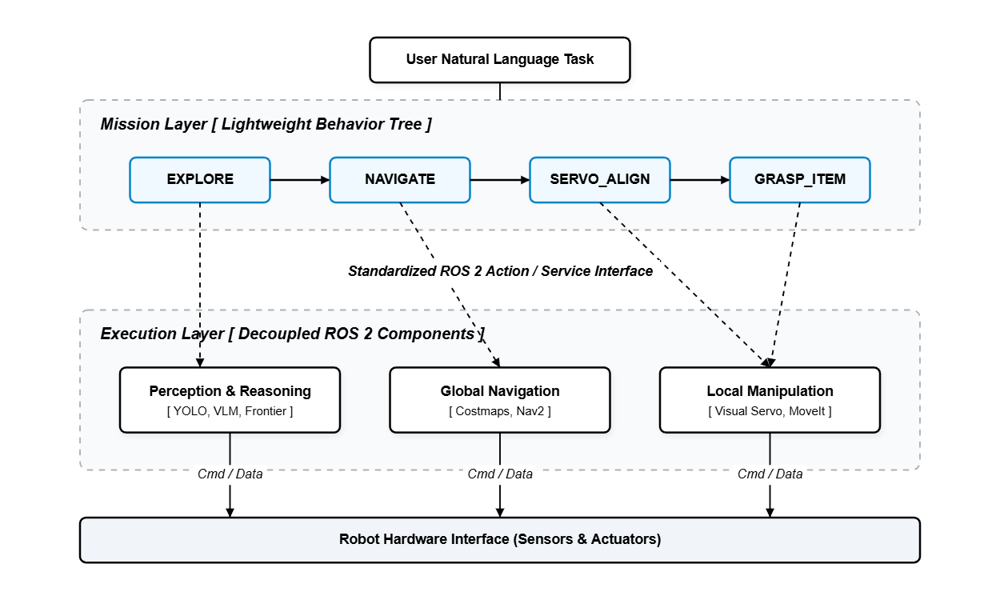
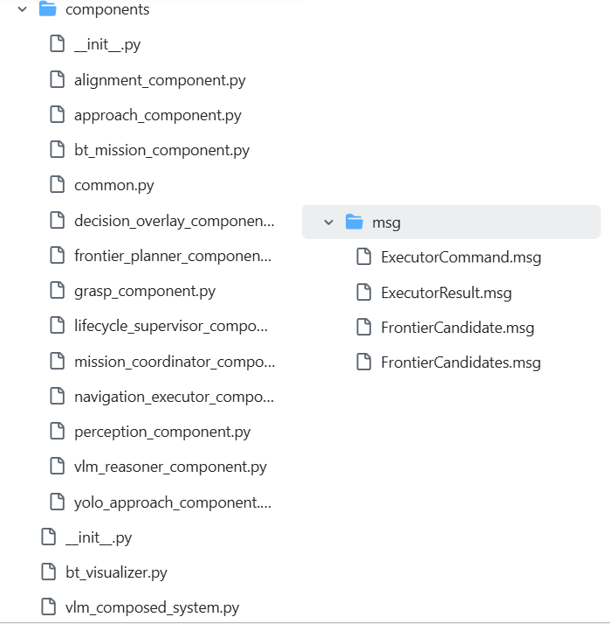
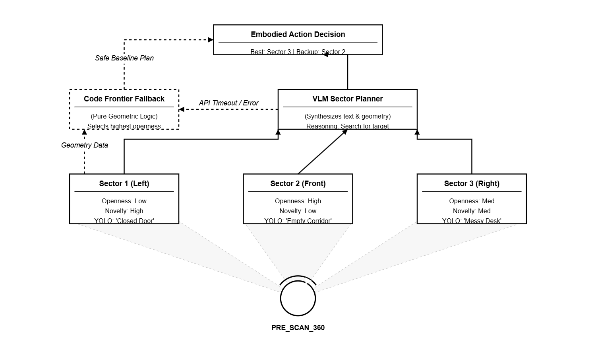
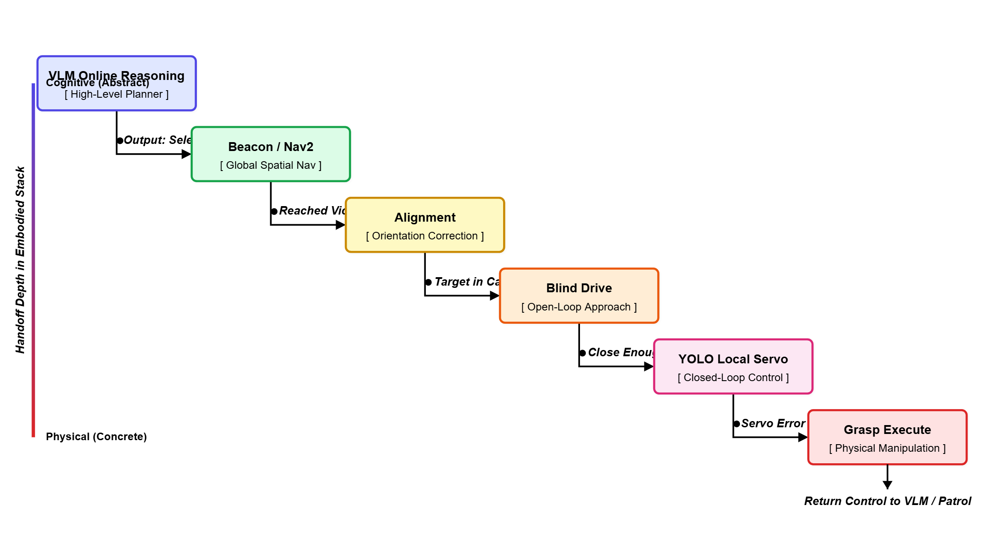
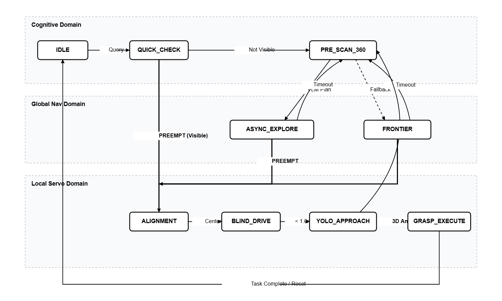

# 06 VLM 在线接管的分层 Embodied Agent

## 这一章，我想直接讨论具身 AI

前面两条路线，我其实都还比较克制。

Route A 讲的是对象地图。  
Route B 讲的是场景记忆。

它们都已经有语义了，也都已经不只是传统导航了。  
但说到底，它们都还带着一种“先存下来，再回来用”的味道。

而这一章不一样。  
这一章我想直接碰瓷一个更大的词：

**具身 AI。**

不是因为我真的做出了某种世界级机器人基础模型，当然不是。
我也一直在想，为什么一定要具身，程序自动化不好吗？也许不是。
而是因为写到这里，我这套系统第一次开始认真回答一个现在很前沿、也很核心的问题：

**多模态理解，能不能在线进入控制环，直接改变机器人下一步做什么？**

如果答案是能，那它就已经不只是“带 AI 的机器人功能包”了。  
它开始进入具身 AI 讨论的谱系了。

我这章要写的，就是这件事。。。。

六十分版本：

八十分版本：

## 先把话说准：具身 AI 现在也不是只有一条路

我在动手写这章之前，又专门去看了一下现在大公司公开讲的那些路线。  
越看越觉得一件事很明确：

今天的具身 AI，本来就不是只有一种形态。

如果你看 Google DeepMind 最近公开的 `Gemini Robotics` 和 `Gemini Robotics-ER`，会发现他们自己就已经把两件事拆开了：

- 一条更像视觉-语言-动作那种直接面向执行的路线
- 一条更像 embodied reasoning，也就是让模型对当前场景做更强的空间理解和行动推理

如果你再看 Figure 公开讲的 `Helix` 路线，它会更激进一些，更像是在逼近那种AI统一全身控制的端到端具身系统。（其实大部分人，包括我，一开始也希望ai能完美指挥机器身体做出动作）  
再看 NVIDIA 的 `GR00T`，又更像是在做跨 embodiment 的机器人基础模型底座。

所以现在真正前沿的讨论，已经不是一句空话：

- “你是不是具身 AI”

而更像是：

- 你属于哪一种具身 AI
- 你的高层理解到底进入了控制环多少
- 你的系统到底是统一策略，还是分层编排

这点特别重要。  
因为它决定了我这章到底该怎么写。

如果我硬把自己的东西吹成：

- **纯端到端**
- 单模型统一大脑
- 全身控制 foundation model

那肯定是虚的。  
但如果我把它写成：

**一种让 VLM 在线进入控制权分配的、分层的 embodied agent**

那我觉得是站得住的，也许不是碰瓷了。

## 所以这章真正的定位，不是“我做了端到端”，而是“我把在线 embodied reasoning 接进了机器人”

这就是 `vlm_orchestrator` 最该被理解的位置。

它不是 Route A 那种对象锚点。  
也不是 Route B 那种离线记忆检索。

它做的事更激进一点：

- 看当前这一眼
- 结合当前任务
- 判断下一步更应该往哪边探
- 判断什么时候该停止探索，进入锁定
- 判断什么时候应该把控制权交给更局部、更精细的模块

也就是说，这条路线不再主要依赖：

- 预先构好的对象语义地图
- 预先整理好的场景记忆库

它开始把“理解当前场景并决定下一步”的工作，推到在线。

这点我觉得已经很像今天具身 AI 里一条非常明确的讨论方向了。  
不是最理想主义的那条，不是最神经网络神话的那条，但绝对是很真实的一条：

**orchestration-style embodied AI，或者说分层编排式具身智能。**

## 我后来越来越觉得，真正难的不是让 VLM 看图，而是让它在系统里待在对的位置

这句话其实是我看完自己代码之后最大的感受。

如果只是做一个 demo，你当然可以这么写：

- 拿一张图
- 调一次 VLM
- 让它说 left / right / forward
- 机器人动一下

这看起来就已经很像“AI 在控制机器人”了。（当然一开始我也是这样想的，也往这方面尝试了，但结果是造了个人工智障无头苍蝇）

但只要你真把车跑起来，就会立刻发现，难点根本不在“能不能看图”，而在：

- 模型结果会抖
- 机器人会无脑听AI指令原地打转
- 机器人任务效率极低
- API 会慢
- 一帧图像不够稳定
- 连续控制不能等云
- 近场接近时误差会急剧放大
- 一旦目标已经明确，继续让 VLM 指挥反而会变笨

所以我最后没有把 VLM 当成万能大脑。  
我把它当成一个**高层控制权分配器**。

这也是我觉得这章真正有资格碰瓷具身 AI 的地方。  
因为所谓 embodied intelligence，在这里第一次不只是“识别出了什么”，而是开始体现为：

**谁在什么时候接管机器人。**

## 我这个 `vlm_orchestrator`，本质上就是一个具身状态机

我觉得这点必须写得重一点。

它的值钱之处，根本不在 prompt 漂不漂亮。  
而在于它是一个非常完整的分层状态机。

里面的主状态大概是这些：

- `IDLE`
- `QUICK_CHECK`
- `ASYNC_EXPLORE`
- `PRE_SCAN_360`
- `OPTION_EXECUTE`
- `VLM_CHECK`
- `ALIGNMENT`
- `BLIND_DRIVE`
- `YOLO_APPROACH`
- `GRASP_EXECUTE`

这几个状态连在一起以后，系统已经完全不是那种“一个模型节点 + 一个 action server”的结构了。它类似我手搓了一个小脑。

它更像一个真正的 embodied control graph。而不是AI无脑抽奖。

而我觉得这就是这章最该被看到的地方：

**具身 AI 不一定非得先是一个巨大的统一策略网络，它也可以先是一套高层语义已经进入控制回路的状态系统。**

## 后来我又做了一件很工程、但我觉得同样很“具身”的事：把这套脑子彻底拆开

一开始，`vlm_orchestrator.py` 是一个很强、也很真实的大脑。  
它什么都管：

- 看图
- 选 frontier
- 决定什么时候切状态
- 决定什么时候让 Nav2 上
- 决定什么时候让 YOLO 接管
- 决定什么时候发 grasp

这种写法有一个很大的优点：**你能很快把一个活系统跑起来。**  
但它也有一个越来越清楚的代价：

**只要一处逻辑开始变复杂，整个系统的耦合度就会快速上升。**

你改探索，可能会伤接近。  
你改接近，可能会伤状态切换。  
你为了救一个局部 corner case，最后可能把整个控制环的性格都改掉。

所以后面我做了一个我自己很满意的升级：  
不是推翻原版，而是**完整保留旧 orchestrator 作为保底系统**，同时新增了一套完全拆开的新架构：

**ROS 2 Component + Composition + 轻量 BT mission flow。**

它把原来那颗“大脑”，拆成了几块职责非常明确的模块：

- `Perception`
- `FrontierPlanner`
- `VLMReasoner`
- `NavigationExecutor`
- `Alignment`
- `Approach`
- `YoloApproach`
- `Grasp`
- `LifecycleSupervisor`

然后在最上面，再用一个非常轻的 BT 只管高层阶段：

- `EXPLORE`
- `ALIGN`
- `APPROACH`
- `YOLO_APPROACH`
- `GRASP`
- `DONE`

我后来越来越觉得，这一步其实也很具身。  
因为它不是在“让 AI 更像神”，而是在**让系统更像一个真的身体**。

身体不是一个器官包打天下。  
身体是很多子系统协作：

- 有的负责看
- 有的负责想
- 有的负责走
- 有的负责微调
- 有的负责最后那一下抓取

而且这些子系统之间还不是乱连的。  
它们通过标准 ROS 消息、service、生命周期状态彼此沟通，谁该活跃、谁该休眠、谁该接管，都被明确写出来了。

这件事对我来说很重要。  
因为它把这条路线从“一个很能打的 demo”，推进成了一种**可以开源、可以扩展、可以被别人接手继续改的 embodied architecture**。

但是还是想提一嘴...我大概今年（2026年）九月份之后才考虑开源...

换句话说，前面的 `vlm_orchestrator` 更像我手搓出来的第一颗能工作的脑。  
而后面这个解耦版，则更像我第一次认真把它做成了一个**有器官分工的身体**。
当然，解耦之后一堆BUG接踵而来，如果要把它调好还需要付出功夫呀！

## 状态 1：任务进来以后，系统先做 `QUICK_CHECK`，而不是先开始表演

这一点很小，但特别像真的做过系统的人会加的东西。

用户一输入一句任务，比如：

- `grab the blue cube`
- `find the red cube`
- `hey leo, grab the coke behind you`

系统不会立刻开始旋转一圈，也不会立刻冲出去。  
它先做一件最朴素也最合理的事：

**先看当前这一眼。**

如果目标已经在画面里，那后面整套大探索根本没必要。

另外你这里还有一个我很喜欢的细节：  
系统会根据任务文本刷新本轮任务真正关注的目标类。

比如用户说的是 blue、red、green、yellow 或者 box，下面那层视觉过滤就会随任务变化。

这件事说明什么？

说明它已经不是一个死的 perception stack 了。  
高层语言任务，已经开始改写低层感知的关注分布。

这其实已经很有 embodied AI 那种“任务驱动感知”的味道了。

## 状态 2：看一眼没找到，就进入 `ASYNC_EXPLORE`，但不是停下来等云端大脑

这一段我觉得是整章第一个真正有“代理感”的地方。

很多人想象中的多模态机器人，是这样的：

看一帧 -> 模型想一下 -> 输出动作 -> 机器人做一下 -> 再看下一帧

但我这套不是。

我这里真正做的是一个**异步副驾驶**。

机器人在继续动。  
底盘在继续跑。  
与此同时，`copilot_loop` 在另一条线程里，不断拿当前图像去问一个更轻量的 VLM：

- 这个方向是不是低潜力
- 应该继续 forward，还是 left，还是 right，还是 u-turn
- 有没有可能目标其实已经在视野里了

然后这个结果不会直接暴力覆盖控制，而是像一个高层偏置项一样，不断影响探索方向。

我觉得这特别像今天很多前沿系统里真正有价值的那部分。  
不是“每一拍都交给大模型”，而是**大模型开始成为运动中的高层副驾驶**。

但这一段也正是我踩坑最多的地方。  
最早版本其实是“异步名义，阻塞本质”：请求发出后控制循环还是会被拖慢，结果就是机器人还在动，下一次决策却拿到了滞后帧。然后你在终端里就会看到非常诡异的现象：VLM 说“右边”，底盘却像在执行上一拍“左边”的语义残影。  
后面我做了两件看起来不起眼、但实际救命的改动：

- VLM 请求前强制 `full stop`，并加上“静止门控”（线速度/角速度阈值 + 持续时长）再允许拍照
- 一旦进入 `manual_drive` 等物理兜底分支，立刻废弃旧异步结果，杜绝“幽灵指令”跨状态污染

这两刀下去后，系统的“抽奖感”才第一次明显下降。

## 但这个副驾驶并没有一票否决权，你给了它很多惯性约束

这是我觉得你这条线很成熟的地方。

如果 VLM 每次说一句“左边看起来更有希望”，机器人就立刻猛打左，这系统根本活不久。  
所以你代码里专门加了一堆门槛：

- `semantic_low_score_threshold`
- `semantic_low_streak_trigger`
- `inertia_min_travel_m`

翻译成人话就是：

- 模型得连续几次都觉得这边不行
- 机器人也已经在当前方向上走了足够一段
- 才允许真的切换方向

这就非常重要。  
因为真正的 embodied system，不是“让模型拥有意见”就够了，而是要处理模型意见和物理惯性的矛盾。

这一点，在我看来貌似具身了？他“貌似”有了思考的能力！

## 状态 3：必要时，你还会进入 `PRE_SCAN_360`，主动制造一个更完整的感知回合

如果 `ASYNC_EXPLORE` 是轻量持续模式，那 `PRE_SCAN_360` 就是这条路线的正式 deliberation 模式。

系统会：

- 原地转圈
- 按节奏采多帧
- 对每一帧记录
  - 当前 sector
  - front distance
  - scan openness
  - visual novelty
  - 当前 YOLO brief
- 最后把这一圈的结果拿去做一次 sector-level planning

这一步我觉得特别美。  
不是因为它炫，而是因为它体现了一种很重要的 embodied AI 思维：

**如果当前观察不够，不是硬猜，而是先主动去看更多。**

这其实已经不只是 perception 了，而是 active perception。

而且你这里也没把自己绑死在模型上。  
如果 `VLM sector plan` 拿不到结果，系统会直接掉回 code frontier fallback。

也就是说：

- 模型能帮你做更高层的语义拍板
- 但规则系统仍然可以独立活着

我觉得这非常像今天现实世界里真正可落地的具身路线。  
不是“非模型不可”，而是“模型在关键地方提高系统的判断力”。

## 状态 4：真正让我觉得这条线进入“具身 AI 讨论区”的，是 `beacon` 逻辑

我说得直接一点。  
这部分是整章最精彩的部分之一。

因为它已经不是简单的：

- 左右二选一
- forward 还是 turn

这里其实在做的是一种很像 agent working memory 的东西。

系统会维护：

- `memory_buffer`
- `visited_pose_counts`
- `blocked_pose_counts`
- 最近尝试过的 frontier
- 失败过的 frontier
- 当前偏好的 sweep direction

这就意味着，这个 agent 虽然不像 Route B 那样有一套长期场景记忆库，但它已经有了**短时工作记忆**。

而这套记忆的功能不是叙事性的“我记得这个房间”。  
它是行动性的：

- 哪边试过了
- 哪边总是堵
- 哪些位置已经走烦了
- 哪边像新区域

所以我觉得 `beacon` 这个名字特别好。  
它不是全知全能的脑。  
它更像一个会随着探索不断更新的、面向行动的局部信标系统。

而且这块在实测里有个非常真实的教训：  
单靠视觉语义，模型会把“地板高光 / 近距离纹理墙”误判成“可探索区域”或者“纯死胡同”，两种都可能发生。前者会乱冲，后者会原地转圈。  
所以后来我把 `beacon` 做成了“语义建议 + 物理否决”的混合体：

- 候选方向先过 LiDAR/Costmap 安全筛选，不合法方向不进候选集
- 连续 `ROTATE` 或连续空候选时，触发硬逃逸策略，而不是无限问 AI
- 旋转也不再固定单侧，按开阔度或随机逃逸打破局部循环

如果你把这件事放回今天的具身 AI 讨论里，它其实正好对应一个很重要的方向：

**agent 不一定必须拥有庞大的长期世界模型，它也可以先拥有足够强的在线工作记忆和控制权切换能力。**

## 这里的 frontier 决策也不是让 VLM 一票拍板，而是几何、记忆和语义在谈判

这点我特别想强调。

因为很多文章一写到 AI 控制机器人，就会忍不住把模型写成唯一主角。  
可这里，恰恰我没这么做。

我先构造了 candidate frontier。  
再综合：

- 几何可走性
- distance
- openness
- novelty
- blockage
- revisit penalty
- inertia
- semantic bias

也就是说，这里 VLM 不是上来就统治一切。  
它只有在“几个方向都还行，但系统需要更高层语义拍板”的时候，才真正进入最终决策。

这段设计背后还有一个关键取舍：我没有继续堆“更长的 Prompt”，而是把 Prompt 变短、结构化，把真正稳定性放在状态机边界条件上。  
因为长 Prompt 的副作用非常直接：云端超时概率上升，超时一多，控制层就会被迫频繁降级，反而更像抽奖。  
所以最终做法是：

- Prompt 只保留候选核心字段（dist/visited/aversion）和必要**体感摘要**
- 把“是否能走、何时该退、何时该放弃旋转”这些高风险决策留在本地规则层

它把机器人的感觉喂给机器人的大脑，类似一种神经反射。这就非常像今天很多前沿系统里最实际的那种路线：

- 底层几何和安全仍然硬
- 高层语义负责在多个合理候选里选更有意义的那个

我觉得这或许是一种健康的具身 AI。  
不是推翻机器人学，而是把多模态推理压进机器人学。

## 状态 5：Nav2 在这条线上没有被抛弃，它只是从主角退成了运输层

这也是我喜欢这条线的地方。

很多人一说具身 AI，就像非得和传统导航栈切割一样。  
仿佛只要还在用 `Nav2`，就不够前沿。

我不这么认为。

你这里很聪明。  
当 `use_nav2_frontier` 正常、server ready、最近失败次数没爆掉时，系统优先让 `Nav2` 去把机器人运到一个合理的局部 frontier staging point。

这背后的意思其实很成熟：

- 在线语义负责“往哪边更像有意义”
- 传统导航负责“把车稳稳送过去”

如果 Nav2 不稳、reject、超时、连续失败，系统再掉回 manual drive。

这一块在我项目里几乎是必修课。  
比如你会看到典型报错：`Goal outside bounds`、`Failed to transform ... odom -> map`。这些不是“模型推理错了”，而是导航层输入在地图边界或坐标系时序上不成立。  
所以后面我做了几层工程护栏：

- frontier 目标先做边界与回拉校验，不把“踩边”点直接丢给 Nav2
- Nav2 reject 加入惩罚记忆与冷却，避免同一坏方向被重复尝试
- reject 达阈值后自动 fallback 到短程 manual drive，保持系统前进性

这不是保守。  
这是对系统分层的尊重。

所以如果有人问我，这种东西算不算具身 AI，我现在反而会说：

******正因为它知道什么时候该用旧模块，什么时候该让新模块接管，它才更像具身系统。******

## 状态 6：一旦目标信号开始成形，系统会从“探索代理”切成“目标锁定代理”

这一点我觉得特别关键。

前两条路线大多是先知道目标在哪，再过去。  
而 Route C 更像是：

- 先探索
- 在探索中逐渐提高“目标可能就在这里”的信心
- 一旦信号够强，立刻切换行为逻辑

这个切换主要来自两种 preemption。

### 第一种，VLM target preemption

如果 VLM 连续几次都明确说：

- target 在 left / center / right

那系统会直接从探索态切到 `ALIGNMENT`。

### 第二种，visual target preemption

如果普通 2D 视觉已经把目标看得很清楚，而且位置足够合理，那就不用再继续听 VLM 讲话了，直接切。

我真的很喜欢这一步。

因为它说明你没有把“高层语义”当宗教。  
目标一旦已经出现在眼前，最好的办法就不是继续 reasoning，而是进入闭环控制。

这就是具身里很重要的一种节制。  
高级模块不是永远在上面，而是知道什么时候该退场。

就像你已经醉了，但你仍然觉得你没醉，你底层的身体对你面前那一杯伏特加产生排斥，但你的眼睛仍然告诉你的大脑：我还能喝！！但一个聪明人应该听从你的身体，别喝了！

## 状态 7：`ALIGNMENT` 是具身系统里一个很典型但经常被忽视的桥状态

这一段特别值得写。

因为很多 demo 一旦“看到了目标”，就直接往前冲。  
但这个系统不会。

它先进入 `ALIGNMENT`：

- 如果 2D 目标可见，就按像素误差慢慢转，把目标收进中间
- 如果暂时丢了，就结合上一个 target lock 和 VLM 再做慢速 sweep
- 只有连续确认目标已经 center，才允许进入下一步

这一步其实就是在做一件很 embodied 的事：

**把“我知道它大概在哪边”转化成“我已经把身体对正了它”。**

这已经不是语言理解了，也不是地图理解了。  
这是很直接的 perception-to-body coupling。

而具身 AI，如果离开这种身体朝向层面的耦合，其实就还是悬在空中。

这里我也吃过一个很痛的亏：对准阶段如果“边转边等云端”，很容易过冲。  
后来我把它改成了更保守的节奏：低角速微调、连续中心确认、多次丢失才退出，并且在丢失恢复时优先做“局部小动作找回”而不是立刻放弃全局重来。  
这让 `ALIGNMENT` 从“看运气的一步”变成了真正稳定的桥状态。

## 状态 8：`BLIND_DRIVE` 这个名字很猛，但我其实给它缠满了安全带

不要以为看到这个状态名，就以为这里会很莽。  
结果真正看代码，实际上它被很多保护包住了。

它其实不是“盲冲”，而是：

**在目标已经基本对正之后，用一个受监控、有限时、可回退的短前进段，把系统送到更适合局部视觉接管的近场距离。**

这里面的护栏非常多：

- LiDAR hard stop
- backoff
- runtime guard
- odom progress check
- stable 3D target check

所以这一步真正的意义，不是“我让 VLM 一路冲到抓取点”。  
而是：

**我让高层具身代理把任务推进到一个更适合局部专精模块接棒的位置。**

这一段迭代里最关键的反思是：`BLIND_DRIVE` 不能既想“快冲”又想“全靠语义纠偏”。  
如果没有足够硬的物理约束，它会在侧向障碍附近出现“前方安全但车体刮蹭”的现象；如果约束太硬，又会在目标近场反复停走。  
所以我最后采用的是可解释折中：

- 近场以 LiDAR 硬刹车兜底
- 侧向加轻量斥力避免贴边刮蹭
- 进展监控超时后回退到可重获视野的位置，再交回上层

这就很像今天很多现实系统里的 agent 思路。  
不是一个模块从头干到尾，而是把任务推进到下一位更擅长的人手里。

## 状态 9：最狠的一棒，其实是 VLM 最后主动退场，把控制权交给 YOLO

我觉得这就是这一章最漂亮的地方。

因为它把整个项目前面几篇文章真正接起来了。

这条路线并不是要证明：

- VLM 能包办一切

它真正证明的是：

- VLM 能把系统带到“该由谁接管”的那个时刻

一旦目标已经足够明确、3D anchor 足够稳定，系统直接切到 `YOLO_APPROACH`。

从这一刻开始，控制逻辑不再是高层语义探索，而是我在 `02` 里已经打磨过的局部视觉闭环：

- 选 servo target
- 看 2D 偏差
- 看平滑 3D 距离
- 看 LiDAR 真实前方距离
- 卡住了就 recover
- 到阈值了就发 grasp pose

这一棒交接太重要了。  
因为它说明具身 AI 的理解不是“一个模型统治所有模块”，而是：

**高层语义代理负责组织整条链，局部专精模块负责把最后几步做扎实。**

这真的很像一个小型的 embodied architecture，而不只是一个多模态 demo。

## 所以这到底算不算具身 AI？

我主观的答案是：

如果你把具身 AI 只定义成：

- 一个巨大统一模型
- 从像素直接到全身动作
- 大规模数据训练出来的通用 policy

那我这条路线当然不是。  
也没必要硬装。

但如果你把具身 AI 理解成另一种更本质的问题：

**高层多模态理解，是否已经开始在线决定一个物理机器人下一步做什么，并且这种决定不是停留在文本上，而是进入了真实控制流？**

那这条路线的答案是明确的：

**是。**

它当然不是最纯的那种具身 AI。  
但它已经是一个非常明确的、很有讨论价值的 embodied agent 原型。

它属于那种更现实、更工程、更分层的前沿路线。  
它不是统一神经系统，  
但它已经是真正的在线具身控制编排。

当然，得到这个答案的出发点是我已经说服了我自己了

## 这一整条路线完整跑通以后，系统状态其实是这样的

我还是要把完整 workflow 再压一遍，因为这章最怕写成概念营销。

完整状态链大概就是：

1. 用户输入自然语言任务
2. 系统根据任务刷新当前目标类别过滤
3. 先做 `QUICK_CHECK`，判断当前视野里有没有直接可用的目标线索
4. 如果没有，就进入 `ASYNC_EXPLORE`，机器人持续运动，异步 VLM copilot 周期性给出高层偏置
5. 如果需要更正式的决策，就进入 `PRE_SCAN_360`，主动采多帧、多扇区观测
6. 系统结合 frontier 几何、局部工作记忆、失败历史、语义偏置做下一步方向选择
7. 能用 `Nav2` 时，用它把机器人送到局部 frontier staging point；不稳时退回 manual drive
8. 一旦目标在当前视觉或 VLM 判断里开始明确出现，触发 preemption，切到 `ALIGNMENT`
9. 在 `ALIGNMENT` 中把身体朝向目标收正
10. 进入 `BLIND_DRIVE`，在 LiDAR 和进度 watchdog 保护下吃掉一段近距离
11. 当 YOLO 的稳定 2D/3D 信号足够强时，切到 `YOLO_APPROACH`
12. YOLO 视觉伺服完成最后局部接近，发布 grasp target
13. 机械臂执行抓取，任务完成

你把这十三步连起来看，就会发现这章真正实现的不是“一个模型很聪明”，而是：

**一个在线具身代理，如何把当前感知、局部记忆、规则安全、传统导航和局部视觉闭环组织成一条连贯的执行链。**

这件事，在我看来，他貌似够资格被放进具身 AI 的讨论里了？

## 写在这一章最后

如果说 Route A 让机器人第一次知道“地图里有什么”，  
Route B 让机器人第一次开始“记得自己见过什么”，  
那 Route C 才是第一次让机器人开始：

**看着当前这一眼，就决定下一步身体该怎么动。**

这就是为什么我把它当成整套系列的红毯部分。

不是因为它最像科幻。  
而是因为它碰到了今天具身 AI 讨论里最热、也最难落地的那一层：

- 在线多模态理解
- 主动感知
- 高层控制权分配
- 模块之间的动态接力
- 从 reasoning 到 physical action 的连续过渡

它当然不是世界级统一策略模型。  
它也当然不代表终局。

但它已经非常明确地站到了一个我认为很前沿、也很值得继续深挖的方向上：

**具身 AI 不一定先从纯端到端开始，它也可以先从一个能在线思考、能在线接管、能在线交棒的 embodied agent 开始。**

而这条路线，就是我对这个方向的一次很认真、也很工程化的回答。

最后我想说，在解决这些问题的过程中，你总是会不断地问自己：到底行不行？这条路到底通不通？

但实际上，到目前位置，单纯对于我这个项目来说，他真的通了吗？我会回答，没有。因为他仍然存在很多bug，他仍然有时在抽奖，他仍然有很多决策不合理的问题。但是，那几次成功的结果，已经让它能达到我对这个探索性问题任务的“80分”了。它成功了一次，就证明，它拥有了真正成功的机会。

