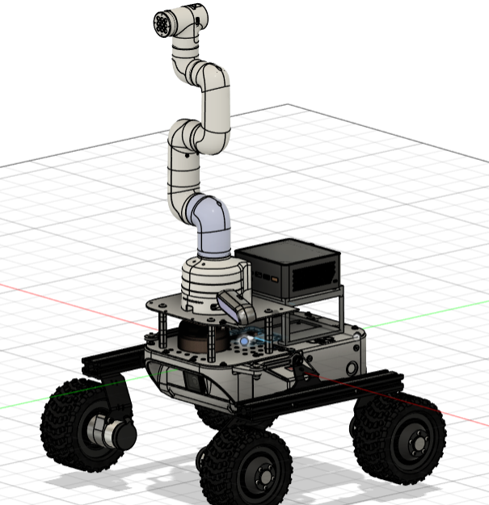
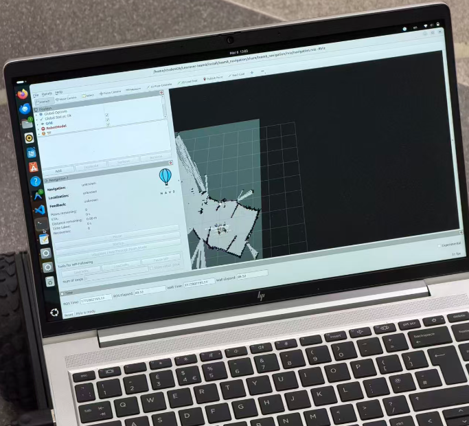
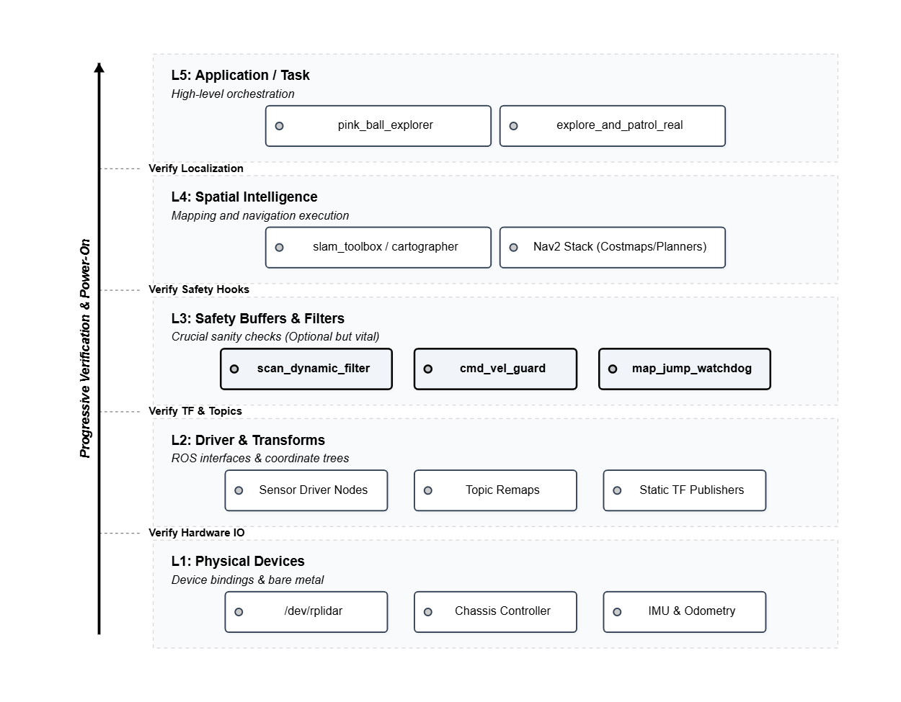
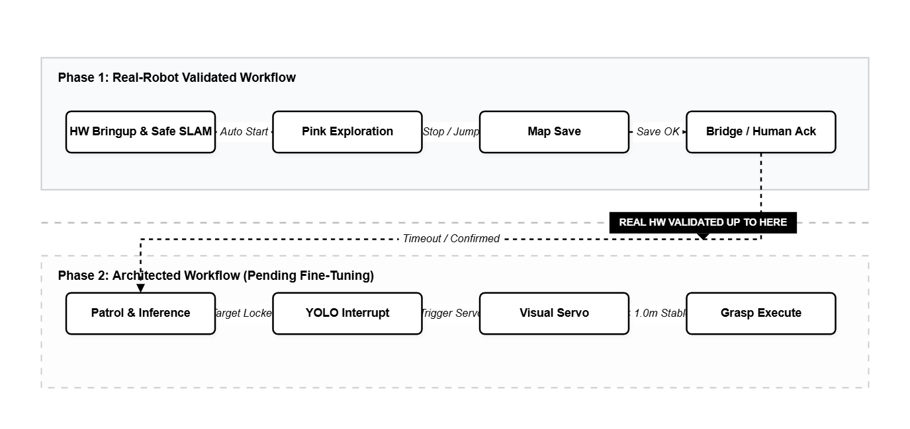

# 07 Sim2Real Coupling on LeoRover: Not Just Moving Simulation to Hardware

## Once the Real Robot Shows Up, the Problem Stops Feeling Romantic

By the time the previous chapters got here, the system was already starting to look like a pretty complete robot workflow.
In simulation, `SLAM`, `Nav2`, exploration, semantic navigation, visual approach, and grasping had basically all been pushed into one chain.

But the moment real hardware enters the picture, the whole mood changes.

In simulation, a lot of the problems are algorithm problems, parameter problems, or state-machine problems.
On real hardware, the first things that jump out are usually much lower-level, much uglier, and much less glamorous:

- is the serial device actually the right device
- is the lidar frame flipped
- should `cmd_vel` really be passed straight to the base
- which laser returns are real obstacles, and which ones are just dirty real-world noise
- are the mapping backend, the controller, and the actual chassis behavior even on the same side

So I do not want to write this as a "successful real-robot demo reproduction" article.
Because honestly, up to this point, the part I have fully tested on the real LeoRover is still mainly the **exploration and mapping** segment.
The later patrol, visual approach, and grasping stages are already connected in software architecture, but lab time simply did not allow me to grind through the entire chain on the real platform all the way to the end.

And yes, four hours of lab time per week is really not enough.
For a real robot system, four hours is barely enough to stabilize the experimental conditions, never mind debugging hardware, restarting nodes, checking TF, watching topics, changing launch files, and rerunning the whole thing.
Very often it is not that the system is impossible. It is that the time window itself refuses to let you smooth it out properly.

That said, I am not pessimistic about the real-robot route itself.
Because the ugliest and hardest part, the part with almost no demo value at all, is already what I spent two very expensive lab weeks chewing through:

**hardware communication and interface coupling**

That means the remaining problems feel much more like parameter tuning and field adjustment, not structural uncertainty about whether the whole system can exist on real hardware at all.

Of course, if time is not enough, then even a good structure can still end up sitting there unused.

## The More I Worked on It, the More I Felt Sim2Real Is Basically Interface Engineering

When people talk about `sim2real`, they often focus on things like domain gap, sensor-noise modeling, and visual generalization.
Those are all important.

But in this project, the first thing that really dragged me into the mud was not any of that.
It was much more direct interface pain:

- the real lidar driver's `frame_id` did not match the chain in the URDF
- the physical mounting direction of the lidar did not match what I assumed in the model
- the chassis should not be fed a completely naked `cmd_vel`
- the real laser contains isolated noise, temporary dynamic occlusion, and dirty near-range data
- during real exploration, one mapping jump can immediately make the control layer start acting weird

So what I actually built for the real-robot layer was not flashy at all, but it was critical:

**I did not rewrite the high-level task logic first. I first patched every interface seam that could otherwise kill the high-level logic.**

And I also wrote a set of nodes specifically for real hardware, fully separated from the simulation side, so the two worlds do not pollute each other.

That is why the final real-robot launch architecture looks similar to the simulation one from far away, but now contains several very reality-specific nodes:

- `scan_dynamic_filter`
- `cmd_vel_guard`
- `map_jump_watchdog`
- `map_snapshot_manager`
- real-hardware-only topic remaps
- real-hardware-only `URDF/xacro`
- real-hardware-only protective launch composition

None of these things are sexy on their own.
But without them, the fancy workflow above probably has no business touching real hardware in the first place.

## The First Real-Hardware Problem I Solved Was Not Navigation

It Was Device Identity

This sounds very earthy, but that is exactly why it is real.

One of the earliest and most annoying real-robot problems is whether the device can even show up with a **stable identity**.
If the lidar is `ttyUSB0` today and `ttyUSB1` tomorrow, then your launch files, drivers, scripts, and startup order all start acting neurotic.

So in the end I added a `udev` rule and fixed the `RPLidar` to `/dev/rplidar`.
In the article it looks like one line.
In reality it represents a very important judgment:

**real-hardware communication must first solve "who is the device," and only then talk about "what is the data."**

That is one reason I say one of the hardest bones is already cracked.
Once the real device identity is stable, a lot of the later launch logic, scripts, and driver entry points finally become repeatable.

## The Real-Robot Launch Is Not a Separate Universe

It Inserts the Risk Points Explicitly into the Main Chain

I did not write the real-hardware side as a completely separate system.
On the contrary, I tried to preserve the same main chain as simulation:

- `robot_state_publisher`
- `TF`
- `SLAM`
- `Nav2`
- exploration / patrol orchestration

What really changes is that I insert several real-world-specific protection and bridging layers before and after that main chain.

For example, in the real-robot launch I explicitly kept:

- both `slam_toolbox` and `cartographer` as mapping backends
- the filtering chain from raw `scan` to `scan_filtered`
- the controlled output chain from `cmd_vel_raw` to `cmd_vel`
- map-jump monitoring and emergency stop
- map snapshots and stable-map backup

The idea behind that is actually simple:

**the difference between simulation and real hardware should not be that the high-level task semantics become totally different. It should be that the low-level constraints are exposed more honestly.**

That is also why I kept many launch parameters behaving like switches.
Not because I want to show off configurability.
But because on a real robot, many capabilities really should be separable, disableable, and replaceable:

- whether to map first without enabling `Nav2`
- whether to enable scan filtering first and only later couple in the velocity protection layer
- whether to use `slam_toolbox`
- whether to use `cartographer`
- whether to enable the jump watchdog

Real hardware is not a place for one-click all-in.
It is much more like staged power-up.
Each extra layer gets you closer to real capability, but also adds another potential failure surface.

## One Very Small but Very Real-Hardware Problem: The Lidar Was Mounted Backwards

So TF Had Better Admit It Honestly

This is a very specific detail from my real setup, but it says a lot about the difference between sim and real.

In the real-robot launch, I explicitly added a static transform from `scan_link` to `laser`, and the default yaw is `pi`.
There is nothing mystical about that. The physical lidar on the real robot is just mounted opposite to what the model assumed.

That detail is barely worth one sentence in a paper.
In a real system, though, it directly decides:

- whether the map grows in the correct direction
- whether obstacles appear at the correct heading
- whether the world seen by `Nav2` is the same world the chassis is physically entering

I gradually accepted one thing:

**real hardware does not forgive a wrong coordinate frame**

In simulation, a lot of things survive through defaults, plugins, or hidden assumptions.
On the real robot, once the coordinate chain is not standing properly, everything above it becomes a floating building.

## A Real Lidar Is Not a Simulated Lidar

So I Inserted a Separate Scan Filter Layer

I think this layer is quite representative.

In Gazebo, the laser is often clean, boundaries are neat, and obstacles behave themselves.
Real hardware is not like that.

Real scans contain a lot of annoying junk:

- dirty near-range echoes
- unstable far points
- short-lived dynamic occlusions
- isolated speckle
- fake obstacles that only show up for a frame or two

So I did not send raw `/scan` straight into `SLAM` and `Nav2`.
I inserted a `scan_dynamic_filter` in between.
What that layer does is very engineering-heavy:

- near-range and far-range clipping
- temporal median filtering
- isolated speckle removal
- dynamic-object suppression using a simple background model

In plain language, the goal is to stop the upper layers from treating "brief junk that should never count as stable world structure" as part of the map.

That is extremely valuable on the real robot.
Because what exploration and Nav2 fear most is not "seeing nothing."
It is **seeing a lot of things that should not be trusted, and then trusting them anyway.**

## `cmd_vel` Is the Same Story

On Real Hardware It Cannot Run Naked

Even in simulation I knew velocity should not go wild.
But on real hardware, I explicitly split the control output into two stages:

- upper layers publish `cmd_vel_raw`
- the chassis receives only the protected `cmd_vel`

That middle layer, `cmd_vel_guard`, is basically a very plain realism node.
It does not talk about dreams. It only talks about limits:

- linear speed limit
- angular speed limit
- linear acceleration limit
- angular acceleration limit
- command timeout to zero
- immediate braking during map jump
- and in some modes, reverse motion is simply forbidden

I also wrote a `forward_only` real-exploration profile.
The judgment behind that is actually very clear:
in some exploration scenarios, allowing the base to aggressively move forward and backward is not smarter. On a skid-steer platform, it often pushes the system into exactly the least stable motion regime.

That is the difference between simulation and reality.
In sim you can thrash around.
In the real world, you really cannot.

So sometimes "more conservative" is not capability regression.
It is me explicitly admitting that:

**real-hardware safety and controllable state matter more than one extra theoretical degree of motion freedom**

## For Real Exploration, I Did Not Choose the SLAM That Makes the Prettiest Map

I Chose the One That Hurts the Closed Loop Less

This part strongly echoes the earlier simulation chapter.

On the real mapping / exploration line, I still ended up preferring `slam_toolbox`.
Not because `cartographer` has no value, and definitely not because it cannot build nice maps.
In some conditions, its maps really are very pretty.

But in real exploration, I care more and more about another question:

**can the map keep growing continuously, and can the control loop avoid being repeatedly torn apart by pose correction**

So I kept a more conservative `slam_toolbox` profile specifically for real exploration.
One especially important decision there was to turn off `do_loop_closing` during the exploration phase.

That can sound like a downgrade.
But it really is not.

Because that profile cares more about local consistency than about allowing a large global optimization to yank the map around while the robot is still moving, probing frontiers, and trying to survive the edge of the unknown.

For exploration, "keep growing steadily" is often more important than "make the map prettier right now."

That was another lesson the real robot taught me:

**on a real robot, a beautiful map and stable motion are not always the same thing**

**safety comes first**

## Once Nav2 Reaches the Real Robot, It Does Not Get to Reuse the Sim Parameters

On the real side, I tuned `Nav2` much more conservatively.
In the end I leaned toward things like:

- `RegulatedPurePursuit`
- not always allowing reverse motion
- turn first, then move forward
- larger inflation layers
- a more conservative robot radius
- lower rotational speed
- more obvious recovery backups

All of these are really answering the same question:

**how do you wrap a naturally not-so-elegant chassis into a navigation behavior that does not feel neurotic**

A base like LeoRover is not the kind of platform that looks beautiful when doing tiny in-place corrections.
Sometimes the more aggressive the controller gets, the more it looks like the controller is fighting the physical reality of the chassis itself.

So by the end, tuning real-hardware Nav2 felt less like pure optimization and more like doing something slightly gray but very honest:

teaching the robot to drive with a little respect.

## The Real-Robot Workflow Is Actually Already Written

The Experimental Validation Just Stops at the Exploration Boundary for Now

I want to make this point clear, otherwise it is very easy to misunderstand the real-hardware side as "only some scattered tests."

That is not really the case.

In terms of code structure, the real-hardware workflow is no longer a pile of fragmented scripts.
It is already a clearly orchestrated state chain:

1. launch the protected real-hardware mapping / navigation environment
2. enter the `PinkBallExplorer` exploration phase
3. save the map automatically after exploration
4. enter a bridge-style countdown / confirmation phase
5. then switch into the later patrol / visual interrupt logic

So the line of **explore -> save map -> bridge -> patrol** is already fully written in software.

And there are several details here that feel very "real robot":

- exploration supports external stop service / stop topic
- a detected map jump pauses exploration and cancels the current goal
- real exploration defaults to `/cmd_vel_raw`
- patrol reads `/merged_odom` and `/scan_filtered`
- the bridge stage is not a hard cut; it leaves human confirmation and a buffer window

All of that says this layer is no longer a sketch of "what I might do later."
It is already a state machine arranged with actual deployment habits in mind.

The reality is simply that lab time has not allowed me to polish patrol, visual approach, and grasping on the real platform with the same level of detail yet.

That is also why I am okay with this chapter feeling slightly less flashy.
Because the interesting part here really is not one especially pretty demo video.
It is that the **deployment grammar** of the system is already starting to take shape:

- interfaces
- constraints
- protective layers
- state bridges
- future extension slots

## So What This Chapter Really Wants to Say Is Not "I Put It on Real Hardware"

It Is "I Cracked Open the Ugliest Layer First"

Looking back now, the most valuable part of the real-hardware side is not one successful motion, not one pretty map, and not just that one launch file happened to run.

The most valuable part is that I have already started systematically pulling many of the low-level problems that usually kill people on real robots into one architecture:

- stable device identity
- real-hardware topic / frame coupling
- filtering of real laser noise
- `cmd_vel` protection and limiting
- map-jump monitoring and emergency stop
- SLAM profiles specific to exploration
- protective real-hardware exploration launch
- bridge states from exploration to later tasks
- and, of course, the ROS communication layer itself

None of these things make the article title sound cooler.
But they determine whether a system is still just "a simulation project," or whether it is finally starting to earn the right to touch a real robot.

If the previous chapters were about capability climbing upward, then this one is more like digging downward.
Not rising higher, but setting roots deeper.

Because every robot project eventually has to answer one question:

**once the system leaves the ideal world, can it still stay alive**
