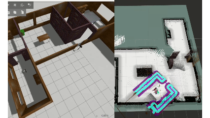
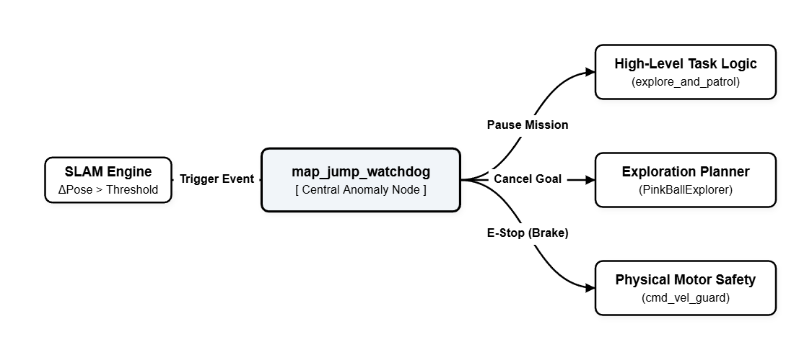
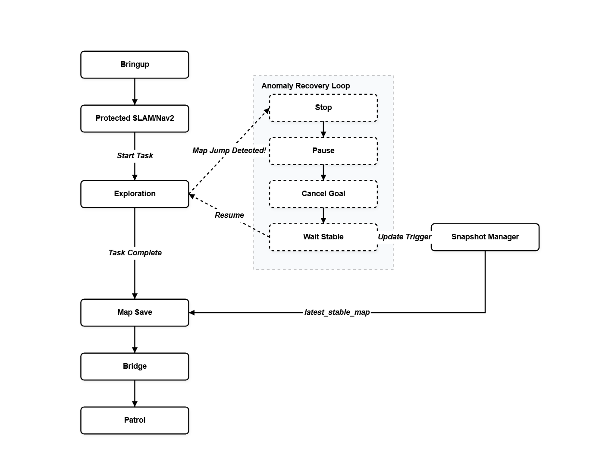

# 08 Watchdogs, Map-Jump Protection, and Stable-Map Patches

## If the Previous Chapter Was About Coupling, This One Is About Not Dying

Once the system reaches real hardware, it starts exposing a very awkward reality.

A lot of the time it is not completely broken.
It can still move, still see, still map, `Nav2` is still alive, and the exploration logic is still running.
But at certain moments it suddenly shows a very familiar set of symptoms:

- the map looks like someone yanked it
- the robot suddenly becomes hesitant or twitchy
- it is walking toward a frontier and then seems to get pulled back
- one second ago it was advancing steadily, the next second the local control loop starts feeling weird

The most annoying part of these problems is that they are not bright-red errors you can point at immediately.
They are more like a system that basically works, and may even already be fairly robust, getting repeatedly interrupted by short, ugly, discrete disturbances from the real world.

So this chapter is not about some magical new algorithm.
At its core, it is a set of patches, a set of watchdogs, and a set of very unromantic but very valuable protection logics.

What they do is actually very plain:

- first admit that the map can jump
- then admit that once it jumps, continuing to charge ahead usually makes things worse
- then hold the system back at that exact moment
- give mapping and pose estimation a little time to settle again
- and at the same time try to preserve the latest map that still looks trustworthy

In one sense, yes, this chapter is solving real-robot jump issues during mapping and exploration.
But if I say it more honestly, the core idea is not mysterious at all. It is almost just a very earthy sentence:

**a lot of robustness, in the end, is just teaching the robot not to rush**

That can sound like regression.
But on a real robot, knowing when to slow down, stop, and wait one breath is often more important than squeezing out a few more steps.

## The More I Worked on It, the More I Felt Robustness Is Not "Never Be Wrong"

It Is "If You Start Being Wrong, Do Not Amplify It"

That was probably the strongest feeling I got from looking back at my own code.

A lot of supposedly robust systems look very strong from the outside.
But when you actually bring them down to engineering reality, the first step of robustness is usually not "the system never makes mistakes."
It is:

**once the system starts making a mistake, do not let that mistake immediately explode into a bigger action disaster**

That is also why I added the watchdog layer on the real robot.
I did not frame the problem as "I must eliminate all map jump."
That is not realistic.

What I cared about more was this:

if `map -> odom` suddenly experiences a pose jump beyond a threshold, and the robot is still driving forward under the old belief, then the consequence is usually worse than the jump itself.

Because at that moment the system starts slipping into a terrible internal misalignment:

- the planner thinks the robot is at A
- the real physical base may now be much closer to B
- the explorer is still sending goals to the old frontier
- the controller is still trying to correct along the path from one moment ago

If action continues amplifying that mismatch, the robot quickly falls into a state where every module is still technically alive, but the whole system feels more and more wrong.

So my response was not flashy.
I simply pulled that moment out as a system event in its own right and gave it a full response chain.

## The Start of This Patch Chain Is Not Recovery

It Is Detecting Whether `map -> odom` Suddenly Changed

The first node in the whole protection stack is `map_jump_watchdog`.

What it does is not complicated, but the logic is very clean:

1. periodically read the `map -> odom` transform
2. compute the translational and rotational difference from the previous sample
3. if the difference exceeds threshold, record one violation
4. only after several consecutive violations does the system formally declare a jump

Those details matter.

First, it is not watching chassis speed or raw odometry.
It is watching `map -> odom`.
So what it cares about is:

**has the global localization layer produced an unnatural discrete correction in a short time window**

Second, it does not scream after one single threshold crossing.
I kept a `consecutive_violations` mechanism on purpose, because I did not want a random twitch to become a false alarm too easily.

Third, translation threshold and rotation threshold are separated.
Because in the real world, a jump does not always mean the robot appears to slide somewhere else.
Sometimes the pose is twisted sharply in orientation instead, and that can be just as destructive for exploration and control.

I like this design a lot.
It is not one of those patches where you guess after something already went wrong.
It defines jump explicitly as:

**an observable, countable, thresholdable system event**

## Once a Jump Is Confirmed, I Do Not Let the System Tough It Out

I Stop It First

This is probably the least flashy but most important decision in the whole patch chain.

Once `map_jump_watchdog` confirms a jump, the first thing it does is not recovery, not replanning, and definitely not gambling.

It does two things first:

- publish zero velocity to `emergency_cmd_vel`
- publish `map_jump_detected = true`

In other words, I put "do not let the robot keep moving blindly" ahead of "should I try to become clever immediately."

That matters a lot in robotics.
Because at the exact moment a jump happens, the danger is not just temporary inaccuracy.
The danger is **continuing to execute with confidence while already being inaccurate**.

That is why the watchdog also includes `hold_stop_sec`.
The meaning is very plain:
do not just tap the brakes for one frame.
Enter a small but explicit window of "stop and do not move."

From far away, that window looks tiny.
Inside a system where mapping, local control, TF, and exploration goals are all cross-coupled, that window gives the whole chain a chance to catch its breath.

## The Most Valuable Part of This Patch Set Is Not the Brake Itself

It Is That the Event Propagates Down the Workflow

If all this did was stop the base once, then it would just be a safety switch.
It starts becoming a real system patch because the jump event does not stop at the watchdog.

It propagates.

First, `cmd_vel_guard` subscribes to `map_jump_detected`.
So even if upper layers still have some stale commands lying around, the protection layer forces the target speed back to zero during the jump window.

Then the real-exploration nodes subscribe to the same event.
Whether it is `pink_ball_explorer.py` or the real exploration wrapper in `explore_and_patrol_real.py`, once a jump happens they do not say "ignore it and keep going."

They do this instead:

- pause exploration for a few seconds
- cancel the current Nav2 goal
- only after the pause window ends do they resume goal selection and continue exploration

That is crucial.

Because exploration is not pure reflex control.
It is a state chain that keeps generating goals and pushing into the unknown boundary.
If the map has just jumped and the explorer still clings to the old frontier, then a lot of the actions generated afterward are already standing on a dirty foundation.

So I did not just add a brake to the base.
I connected the jump event into the entire exploration workflow and turned it into:

`detect anomaly -> brake -> pause -> cancel old goal -> wait for stability -> resume exploration`

To me, that is the real essence of this chapter.

## This Is Not Just "Preventing Jump"

It Is Wrapping the Exploration State Machine in a Thin Low-Gravity Shield

I really want to say this part out loud.

If you only look at the visible result, it is very easy to describe this chapter as:

- detect jump
- robot stops for a bit
- therefore things get more stable

That is true, but it is still too shallow.

A more accurate description is that this patch set wraps the exploration state machine in one extra thin protection layer.
It does not change the exploration goal itself.
It does not change frontier extraction.
It does not change Nav2's basic job.

It simply admits one thing:

**when the global localization layer is undergoing a discrete disturbance, the exploration state machine should temporarily lose the right to act**

That sentence sounds a bit twisted, but it is actually very useful.

Because many systems treat exploration as something that must keep pushing forward no matter what.
I gradually felt the opposite.
Continuous progress is not the goal by itself.
**Not amplifying errors while the state is dirty** is the real prerequisite.

So this chapter looks like a safety patch, but in reality it is already subtly changing the rhythm of the whole system:

- a system is not strong just because it always keeps pushing
- a system that knows when to shut up is often stronger

## The `map_snapshot_manager` Line Matters Too

It Does Not Save the Current Moment, It Saves the Latest Trustworthy Map

Besides the watchdog itself, another line I really like is `map_snapshot_manager`.

What it does is not complicated:

- periodically save map snapshots
- keep several recent historical maps
- continuously update one `latest_stable_map`
- pause frequent saving during the jump event and right after it

The value of that logic is not that it repairs anything on the spot.
It is more like saying:

**if the current map is entering an unstable phase, then at least I must preserve the most recent result that was still stable**

That is very reasonable in the real world.

Because real exploration is not one function call.
It is a continuous process.
The map is not "generated once and correct forever."
It keeps growing, keeps being adjusted, and sometimes gets tugged around locally.

So the idea behind the snapshot manager is actually pretty forward-looking:

- save periodically during normal operation
- do not save blindly during jump
- wait through a cooldown after jump, then resume
- always leave the system with a recent stable-map exit

It is not a flashy feature.
But it changes the whole system from "is it alive at this exact second" into "even if this exact second is messy, the latest stable result is still preserved."

## Looking at the Full Workflow, This Chapter Does Not Patch One Point

It Patches a Whole Segment Called "What Do We Do After Something Goes Wrong"

If you connect this chapter back to the previous ones, the real workflow becomes much more complete.

Originally the line looked more like:

`bringup -> SLAM/Nav2 -> exploration -> save map -> bridge -> patrol`

After this chapter, it becomes more like:

**bringup -> SLAM/Nav2 -> exploration -> jump detect? -> emergency stop -> pause/cancel -> wait stable -> resume exploration -> save stable map -> bridge -> patrol**

In other words, the system finally starts to contain an actual exception branch.

That matters a lot.
Because a workflow without exception branches looks smooth, but deep down it is only a best-case-path workflow.
The moment the map jumps, the pose twists, or the controller starts behaving strangely, you finally find out whether the system has a second layer of thought or not.

What this chapter does is write that second layer of thought into the workflow.

It does not suddenly turn the robot into a highly intelligent being.
It simply makes the system seriously answer one question for the first time:

**if the cognition layer itself is unstable right now, what should the action layer do**

## So Is This Patch Set Basically Just "Make the Robot Run Slower"

In a way, yes.

At least if you look at the final behavior, many of the things this patch set does are all pulling in the same direction:

- acknowledge jump more cautiously
- brake faster
- resume motion more slowly
- continue exploration more conservatively

If you wanted to be mean about it, you could say it just made the system more timid.
I do not think that is a problem.

Because real-robot robustness is often not earned by being more aggressive.
It is earned by fewer wrong actions, less false confidence, and less amplification of bad state.

And from another angle, my original system was not actually fragile to begin with.
The whole `SLAM + Nav2 + pink exploration` stack already had a certain level of robustness. It was not something that completely fell apart from one touch.

So the role of this chapter is not to rescue a system that was completely broken from the ground up.
It is more like adding one more **protective skin patch** to a system that already worked, so that discrete disturbances in the real world are less likely to tear it apart.

And honestly, that is enough.

## I Have Gradually Accepted That Many Smart Real-Robot Patches

Look Like Restraint from the Outside

That is probably the final thing this chapter really wants to say.

Many people think the exciting part must look like a more complex algorithm, smarter reasoning, or a fancier model.
But when I look back now, the interesting thing about this watchdog and safety patch set is not that it is especially complicated.

It is that it is restrained.

What it does is very limited:

- if something looks wrong, stop first
- once stopped, do not pretend nothing happened
- wait a little and let the map settle
- preserve the stable map
- then hand exploration rights back

There is no mythology in that logic.
But it directly determines whether a real robot system is "occasionally able to act once" or "starting to look like it can stay alive for a longer time."

If the previous chapter answered "how do I couple the system onto a real LeoRover,"
then this chapter answers another, heavier question:

**once it is coupled, how do I stop the system from tearing itself apart because of one jump**

And yes, there is even one funny reality here:
a week ago the real-hardware navigation tests were still jumping, and a week later, after the patches, they stopped jumping. I genuinely cannot say with certainty whether it was because the patches worked or because I also made the robot drive more conservatively.

But from the result side, if the system was already able to survive without needing the patch, then the patch not being triggered is also perfectly fine.
It is like an airbag in a car.
You do not hope it explodes.
But it still needs to be there.
