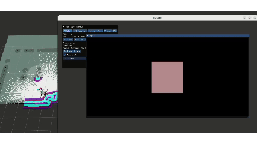

# 09 ROSplat 与 3DGS：我为什么还是想把高斯地图接进来

这一章是外传，而且是很短的一章。

它暂时还不是主线哦。  
我的主线始终还是 `SLAM + Nav2 + 语义导航 + 抓取`。  
但我还是把 `ROSplat` 这条线接进来了，因为到后面我会越来越明显地感觉到，`RViz` 虽然足够工程、足够可靠，却不太适合表达“场景到底长什么样”这件事。

所以我这里做的，不是拿 3DGS 取代主导航，也不是拿高斯地图去直接控制机器人。  
我把它放在一个更克制的位置：**并行表征层。**

从代码上看，这条线其实也很老实。  
我专门留了一个 `rosplat_visualization.launch.py`，默认关闭，需要时才开；它用独立 namespace 跑起来，还支持自动订阅 Gaussian topic，或者直接自动加载 `.ply`。也就是说，它从一开始就不是来抢主系统控制权的，而是作为一层平行视觉化扩展挂在旁边。

但是这也许会成为我后面要去研究的方向的一个大铺垫，因为我现在手头上的东西不支持我去碰3DGS。

## 这条线现在最现实的价值，不是控制，而是“把空间记忆变得可见”

这一点我觉得挺重要。

我前面已经做了对象地图、场景记忆、3D 重定位。  
这些东西其实都说明，机器人已经不只是“会走”，而是在慢慢积累一种更丰富的空间记忆。

但这些记忆很多时候还是太抽象了：

- 2D 地图是平的
- marker 是符号化的
- JSON 是冷的
- 日志是离散的

而 `ROSplat / 3DGS` 这一层的吸引力就在于，它有机会把这些原本抽象的空间记忆重新还原成一种更连续、更接近真实场景的东西。

这里其实也很适合顺手和我已经做起来的 `RTAB-Map` 对比一下。  
`RTAB-Map` 在我这套系统里已经是能工作的东西了，它的价值非常明确：

- 能做 3D 记忆建库
- 能做 kidnapped recovery 这种全局重定位兜底
- 能给系统一个“我好像在这里见过这个场景”的定位依据

但 `RTAB-Map` 更偏功能层。  
它更像一套可靠的 3D 几何记忆和重定位工具，强在“能不能用来定位、能不能用来恢复、能不能支撑导航语义”。

而 `ROSplat / 3DGS` 想补上的，是另一件事：  
**不是先问系统能不能算对，而是问系统能不能把这个场景表达得更像它本来的样子。**

所以如果把两者放在一起看，我会觉得它们不是替代关系：

- `RTAB-Map` 更像现在已经能落地的 3D 工作层
- `ROSplat / 3DGS` 更像未来更强的 3D 表征层

前者已经进入了我的导航、恢复和记忆链路。  
后者现在还主要停留在可视化和表达层，但一旦以后设备、数据和算力条件补齐，它很可能会把“机器人到底记住了一个什么样的世界”这件事，往前推进一大截。

如果这条线以后继续做下去，我觉得它至少有几个很实际的方向：

- 给语义导航和场景记忆提供更强的 3D 回放界面
- 给 kidnapped recovery 提供更直观的重定位可视化
- 给真实探索后的地图质量检查提供更接近场景本体的观察窗口
- 做更好的 demo replay，而不是只看 RViz 里的线和框
- 进一步往数字孪生、离线分析、远程操作理解去靠

说白了，它的第一价值不是让机器人更聪明，而是让机器人已经积累下来的空间知识，终于看起来像“一个场景”，而不只是一些 topic。

## 我现在为什么没继续往下做

原因也很简单，不是这个方向没意思，而是它真的贵。

高质量高斯地图这件事，背后需要的不是一点点热情，而是一整套更昂贵的条件：

- 更好的数据采集设备
- 更稳定的多视角采样
- 更强的 GPU 资源
- 更长的离线重建时间

而我现在手上的条件，更多还是围绕移动机器人主线：先把系统跑通，先把导航、探索、语义、抓取、真机这些更硬的环节顶住。  
在这个前提下，我确实没有条件继续往高质量 Gaussian scene reconstruction 那边深挖。

但是我现在在RTAB那边做的事，都是在朝着3DGS能给我提供的功能去走，相当于用土方法实现了3DGS能实现的功能。

所以这一章更像一个明确保留下来的接口。  
它说明我不是没看到这个方向，而是我知道它值得做，也知道它现在为什么还停在这里。

## 这条线以后如果真补齐，价值会很高

我对这条线的判断其实一直没变：  
它短期看像可视化扩展，长期看未必只是可视化。

一旦设备和数据条件够了，3DGS 这类表示很可能会在机器人系统里承担更重的角色：

- 更细腻的场景记忆
- 更自然的人机解释界面
- 更强的任务回放与错误分析
- 甚至成为具身系统里的长期视觉世界模型之一

所以我现在把它写成外传，不是因为它不重要。  
恰恰相反，是因为它还没被我真正做到底，但我已经能看见它以后可能长成什么样。

