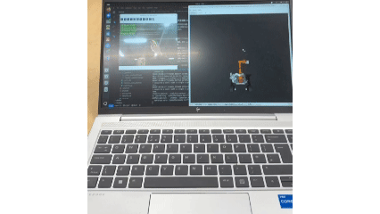

# 10 Gesture-Controlled Robot Arm

## I Saw Those Spray-Paint Robot Videos Online and My Hands Started Itching Too

This chapter really does not need to be taken too seriously.
To be honest, this thing is not exactly useful in any deep strategic sense.

I did not build it because the main project absolutely needed it.
I built it because I saw those videos online where someone waves a hand and the robot follows, and I thought: yeah, that is kind of fun, let me do one too.

Also, slightly tragically, by the time I was writing this article I still had not had time to take it into the lab and test it properly on the real setup.
So yes, once again, lab time is being publicly shamed here.

## The Technical Core Is Much Less Mysterious Than It Looks

The implementation is actually very plain, maybe even a little crude:

- use `Mediapipe Hands` to look at the hand
- count the fingers
- check whether the wrist is left, center, or right in the image
- then brutally map that discontinuous, very human, and not-at-all-reasonable input into two arm joints plus one gripper action

Google already wrote most of the hard part for you, so of course I was going to use it.

The final rules I used were:

- `0` fingers: close the gripper
- `1` finger: control `J1` base rotation
- `2` fingers: control `J2` shoulder lift
- `4+` fingers: open the gripper and hold

Then I added a simple three-zone screen split:

- left means move
- center means stop
- right means move the other way

It sounds a bit ridiculous.
That is part of why it is fun.
It does not pretend to be some elegant human-robot interaction paradigm.
It is just a very direct, very cheap, very demo-friendly form of visual teleoperation for a robot arm.

Of course I could also try to make the arm imitate my own hand joints more closely and grasp that way.
But that is a lot more work, and honestly the goal here was just to make it able to grab things in a reasonably controlled way.
If I turned it into full finger-by-finger imitation, the workload would jump by a lot.

## My Favorite Part in the Code Is Not the Gesture Recognition

It Is That the Whole Thing Ended Up Surprisingly Restrained

Originally I thought a system like this would inevitably be noisy, jittery, and feel like a robot being abused by somebody's fingers.
But once I actually wrote it, I still instinctively added several constraints:

- track only one hand
- reduce camera resolution to `320x240`
- set `CAP_PROP_BUFFERSIZE = 1` to keep latency down
- only control `J1 + J2`
- keep the remaining joints obediently near zero
- smooth the gripper state a bit so it does not spaz open and closed
- clamp every joint into angle limits so the arm does not try to bend itself apart for entertainment

So even though this project absolutely has the flavor of "I got hyped by a short video online and went to build something," I still tried to make it reasonably engineering-minded instead of completely chaotic:

**do not lose control, and do not shake like crazy**

## Its Biggest Value Is Probably Just That It Is Fun

And Honestly, It Is Great for Demo

This thing does not need to be written into some profound philosophical conclusion.
Its most honest value is just:

- it looks intuitive
- people understand it immediately
- it is more dramatic than a joystick or keyboard
- it is very good for demos

And I have to admit, stuff like this has a kind of annoying communication advantage.
I can write all I want about `SLAM`, `Nav2`, semantic maps, RAG, and embodied orchestration.
People who know the field will understand why that matters.
People who do not know the field will just nod politely.

But if the arm follows a hand gesture once, a lot of people immediately react with that very low-level but very real response:

"okay, that is kind of cool."

Shallow? Yes.
Still effective? Also yes.

## So the Conclusion of This Chapter Is Very Simple

It is not a main-line capability, not a strategic module, and definitely not the final answer to human-robot interaction.
It is just a cute little toy.

I saw a robot interaction style that looked fun, my hands started itching, so I built it.
And then it turned out to be genuinely fun.

Honestly, I could probably also make a gesture-controlled mobile base one day and let the robot drive around like it had some tiny spirit inside it.
But okay, I should stop here before this side quest mutates again.
