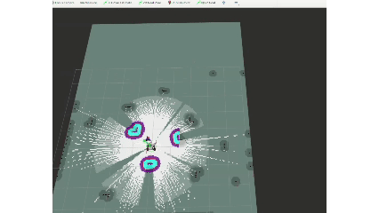
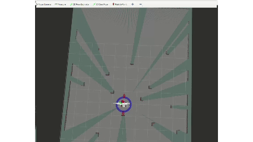
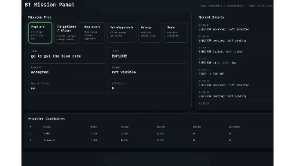

#  LingkBot: A Hierarchical Embodied AI Orchestration System for ROS 2, Nav2, RTAB-Map, YOLO-World, RAG and VLM Robotics

LingkBot is a `ROS 2 Jazzy` robotics system integration project focused on embodied AI, semantic navigation, mobile manipulation, robot perception, and sim2real robustness. It is built around `LeoRover + myCobot 280 Pi + Intel RealSense D435 + RPLidar`, and connects `SLAM Toolbox`, `Cartographer`, `Nav2`, `RTAB-Map`, `YOLO-World`, `RGB-D 3D projection`, `MoveIt 2`, `MoveIt Task Constructor (MTC)`, `RAG memory pipeline`, `VLM orchestrator`, `ROS 2 Components`, and real-robot watchdog layers into one hierarchical embodied agent workflow.

This page is the English index for the `docs/showcase_posts` series. The goal is not to present a single flashy model demo, but to document a system-level path from classical robotics to a hierarchical embodied agent.

> **Open-source plan:** this project is planned to be open-sourced after September 2026. The articles will include more explanation about the open-source plan and scope.

**Keywords:** `Embodied AI`, `ROS 2`, `Nav2`, `SLAM Toolbox`, `Cartographer`, `RTAB-Map`, `YOLO-World`, `MoveIt 2`, `MoveIt Task Constructor`, `MTC`, `RAG`, `VLM Orchestrator`, `Semantic Navigation`, `Mobile Manipulation`, `LeoRover`, `myCobot`, `RealSense D435`, `RPLidar`, `Robot System Integration`, `Sim2Real`, `Behavior Tree`, `ROS 2 Components`

The core system tries to compress the following pipeline into one coherent robotics stack:

`simulation -> mapping/localization -> autonomous exploration -> visual recognition -> 3D target recovery -> robot arm grasping -> semantic mapping -> scene memory -> language navigation -> VLM orchestration -> real-robot safety layer`

## System Stack

| Module | Components |
| --- | --- |
| **Robot Platform** | LeoRover, myCobot 280 Pi, RPLidar, Intel RealSense D435, Intel NUC |
| **Simulation and Visualization** | ROS 2 Jazzy, Gazebo, RViz2 |
| **Localization, Mapping, and Navigation** | SLAM Toolbox, Cartographer, Nav2, RTAB-Map, Frontier Exploration, Behavior Trees |
| **Perception and Spatial Understanding** | YOLOv8 / YOLOv11-Seg, YOLO-World, RGB-D depth fusion, TF2 2D-to-3D projection, Mediapipe Hands |
| **Mobile Manipulation and Grasping** | MoveIt 2, MoveIt Task Constructor (MTC), myCobot manipulation pipeline |
| **Embodied Decision and Memory** | Gemini 2.5 Flash, VLM Orchestrator, RAG memory pipeline, semantic navigation |
| **System Architecture and Engineering** | ROS 2 Components, Composition, lifecycle orchestration, lightweight BT mission flow |
| **Real-Robot Robustness** | cmd_vel guard, map jump watchdog, map snapshot manager, sim2real bringup |
| **3D Representation Extensions** | ROSplat, 3D Gaussian Splatting (3DGS) |

- Chinese index: [`README_CN.md`](./README_CN.md)
- English index: [`README.md`](./README.md)

---

## What This Project Actually Implements

### 1. Classical Robotics Foundation

- `slam_toolbox / cartographer` mapping
- `Nav2` localization and navigation

  
  

- frontier-based autonomous exploration with a custom `pink_ball_explorer`

  

Related article:
- [`01 The Classical Path: Getting SLAM Mapping and Autonomous Exploration Working from Scratch`](./01_the_physical_foundation/01_slam_nav2_exploration_en.md)

### 2. Mobile Manipulation Closed Loop

- target discovery during patrol or exploration
- `YOLO + RGB-D + TF` to recover graspable 3D targets from 2D detections
- `myCobot + MoveIt2 + MTC` for top-down grasp execution
- a full state loop covering exploration, patrol, visual approach, human confirmation, grasp, and recovery

  

Related article:
- [`02 Mobile Manipulation: A Full Closed Loop of Navigation, Detection, and Grasping`](./01_the_physical_foundation/02_full_workflow_vision_grasping_en.md)

### 3. Three Semantic Navigation Routes

- `RTAB-Map` for 3D relocalization and kidnapped robot recovery

  
  

- Route A: `YOLO-World` object-level online semantic mapping and navigation
- Route B: `LLM/VLM + keyframes + RAG` scene-memory navigation

  

- Route C: `VLM orchestrator` for online high-level semantic control handoff

  

Related articles:
- [`03 Kidnapped Robot Recovery: When 2D Navigation Forgets, 3D Mapping Steps In`](./02_semantic_navigation_paradigms/03_kidnapped_robot_problem_en.md)
- [`04 Route A: Object-Level Online Semantic Navigation with YOLO-World`](./02_semantic_navigation_paradigms/04_yolo_world_semantic_mapping_en.md)
- [`05 Route B: Scene-Memory Navigation with LLM Keyframes and RAG`](./02_semantic_navigation_paradigms/05_llm_rag_scene_memory_navigation_en.md)

### 4. Hierarchical Embodied Agent

- `VLM orchestrator` enters the online control loop instead of staying as a passive image-understanding tool
- the robot dynamically decides which module should take over the next physical action
- semantic reasoning, classical navigation, local visual servoing, and grasp execution are organized into one continuous embodied control chain

  
  

Further, `Component + Composition + lightweight BT mission flow` are used to split `Perception / Reasoning / Navigation / Alignment / Grasp / Supervision` into a more maintainable embodied architecture.

  
  

Related articles:
- [`06 A Hierarchical Embodied Agent with Online VLM Control Handoff`](./03_the_embodied_agent/06_zero_shot_vlm_orchestrator_en.md)
- [`07 Sim2Real Coupling on LeoRover: Not Just Moving Simulation to Hardware`](./04_sim2real_and_robustness/07_sim2real_hardware_coupling_en.md)
- [`08 Watchdogs, Map-Jump Protection, and Stable-Map Patches`](./04_sim2real_and_robustness/08_watchdog_and_safety_patches_en.md)

### 5. Side Extensions

- `ROSplat / 3DGS` as a parallel representation layer
- `Mediapipe Hands` for gesture-controlled robot arm interaction

  
  

Related articles:
- [`09 ROSplat and 3DGS: Why I Still Want a Gaussian Scene Layer`](./05_side_quests/09_3dgs_rosplat_visualization_en.md)
- [`10 Gesture-Controlled Robot Arm`](./05_side_quests/10_gesture_control_arm_en.md)

### 6. Epilogue

- this is not a new-algorithm paper project
- this is the evolution of a civilian-scale embodied robotics system
- it is also a case study in why full-stack robotics integration is rare

Related article:
- [`11 This Is Not Just a Comparison of Three Technical Routes, but the Evolution of a Civilian Embodied System`](./06_epilogue/11_semantic_navigation_paradigm_comparison_en.md)

---

## What This Project Is Not

- not a single-paper novelty project
- not an industrial product
- not a fully mass-deployable real-robot closed-loop system

## What This Project Is

- a personal-scale robotics systems integration project
- an evolutionary path from classical robotics to embodied agents
- an attempt to compress mobile robots, robot arms, perception, semantics, language, and real-robot protection layers into one working system

## Recommended Reading Order

1. [`00 From Classical Robotics to Embodied Agents`](./00_preface_and_structure/00_from_classical_robotics_to_embodied_agents_en.md)
2. [`01 The Classical Path: Getting SLAM Mapping and Autonomous Exploration Working from Scratch`](./01_the_physical_foundation/01_slam_nav2_exploration_en.md)
3. [`02 Mobile Manipulation: A Full Closed Loop of Navigation, Detection, and Grasping`](./01_the_physical_foundation/02_full_workflow_vision_grasping_en.md)
4. [`03 Kidnapped Robot Recovery: When 2D Navigation Forgets, 3D Mapping Steps In`](./02_semantic_navigation_paradigms/03_kidnapped_robot_problem_en.md)
5. [`04 Route A: Object-Level Online Semantic Navigation with YOLO-World`](./02_semantic_navigation_paradigms/04_yolo_world_semantic_mapping_en.md)
6. [`05 Route B: Scene-Memory Navigation with LLM Keyframes and RAG`](./02_semantic_navigation_paradigms/05_llm_rag_scene_memory_navigation_en.md)
7. [`06 A Hierarchical Embodied Agent with Online VLM Control Handoff`](./03_the_embodied_agent/06_zero_shot_vlm_orchestrator_en.md)
8. [`07 Sim2Real Coupling on LeoRover: Not Just Moving Simulation to Hardware`](./04_sim2real_and_robustness/07_sim2real_hardware_coupling_en.md)
9. [`08 Watchdogs, Map-Jump Protection, and Stable-Map Patches`](./04_sim2real_and_robustness/08_watchdog_and_safety_patches_en.md)
10. [`09 ROSplat and 3DGS: Why I Still Want a Gaussian Scene Layer`](./05_side_quests/09_3dgs_rosplat_visualization_en.md)
11. [`10 Gesture-Controlled Robot Arm`](./05_side_quests/10_gesture_control_arm_en.md)
12. [`11 This Is Not Just a Comparison of Three Technical Routes, but the Evolution of a Civilian Embodied System`](./06_epilogue/11_semantic_navigation_paradigm_comparison_en.md)
